# TSP Essay
A fun study of some heuristics for the Travelling Salesman Problem.

---
I've always found the Travelling salesman problem particularly interesting.
After studying a few papers on the subject (in this repository too), mainly the superb `Clarke & Wright's Savings Algorithm` from 1997, I felt like trying a few techniques.

To see the original `ipynb` format (probably better): [https://github.com/rsalmei/tsp-essay/blob/master/tsp_essay.ipynb](https://github.com/rsalmei/tsp-essay/blob/master/tsp_essay.ipynb)

To run this yourself, you need:

- a recent python (I'm using 3.6.5)
- a virtualenv
- `pip install -r requirements.txt`
- `jupyter notebook tsp_essay.ipynb`

Enjoy :)

# Setup environment


```python
import pandas as pd
import numpy as np

%matplotlib inline
%config InlineBackend.figure_format = 'retina'
import matplotlib.pyplot as plt
from pylab import rcParams
```

    /Users/rogerio/.pyenv/versions/3.6.5/lib/python3.6/importlib/_bootstrap.py:219: RuntimeWarning: numpy.dtype size changed, may indicate binary incompatibility. Expected 96, got 88
      return f(*args, **kwds)
    /Users/rogerio/.pyenv/versions/3.6.5/lib/python3.6/importlib/_bootstrap.py:219: RuntimeWarning: numpy.dtype size changed, may indicate binary incompatibility. Expected 96, got 88
      return f(*args, **kwds)


## Customize graphics style


```python
print(plt.style.available)
```

    ['seaborn-dark', 'seaborn-darkgrid', 'seaborn-ticks', 'fivethirtyeight', 'seaborn-whitegrid', 'classic', '_classic_test', 'fast', 'seaborn-talk', 'seaborn-dark-palette', 'seaborn-bright', 'seaborn-pastel', 'grayscale', 'seaborn-notebook', 'ggplot', 'seaborn-colorblind', 'seaborn-muted', 'seaborn', 'Solarize_Light2', 'seaborn-paper', 'bmh', 'tableau-colorblind10', 'seaborn-white', 'dark_background', 'seaborn-poster', 'seaborn-deep']


```python
plt.style.use('classic')
rcParams['figure.figsize'] = 16, 10
```

# Initialize data


```python
np.random.seed(18)

size, cmin, cmax = 150, -100, 100
data = pd.DataFrame(dict(x=[0], y=[0])).append(
    pd.DataFrame((np.random.random_sample(2*size)*(cmax-cmin)+cmin).reshape(-1,2), columns=['x', 'y']), ignore_index=True)
data
```


<div>
<style scoped>
    .dataframe tbody tr th:only-of-type {
        vertical-align: middle;
    }

    .dataframe tbody tr th {
        vertical-align: top;
    }

    .dataframe thead th {
        text-align: right;
    }
</style>
<table border="1" class="dataframe">
  <thead>
    <tr style="text-align: right;">
      <th></th>
      <th>x</th>
      <th>y</th>
    </tr>
  </thead>
  <tbody>
    <tr>
      <th>0</th>
      <td>0.000000</td>
      <td>0.000000</td>
    </tr>
    <tr>
      <th>1</th>
      <td>30.074848</td>
      <td>1.090675</td>
    </tr>
    <tr>
      <th>2</th>
      <td>75.720294</td>
      <td>-63.631955</td>
    </tr>
    <tr>
      <th>3</th>
      <td>70.446614</td>
      <td>50.027257</td>
    </tr>
    <tr>
      <th>4</th>
      <td>33.220333</td>
      <td>97.579090</td>
    </tr>
    <tr>
      <th>5</th>
      <td>-48.606315</td>
      <td>-94.338815</td>
    </tr>
    <tr>
      <th>6</th>
      <td>27.143823</td>
      <td>69.462477</td>
    </tr>
    <tr>
      <th>7</th>
      <td>47.234925</td>
      <td>-95.838578</td>
    </tr>
    <tr>
      <th>8</th>
      <td>-77.679374</td>
      <td>-40.455252</td>
    </tr>
    <tr>
      <th>9</th>
      <td>37.394038</td>
      <td>72.325211</td>
    </tr>
    <tr>
      <th>10</th>
      <td>-60.273128</td>
      <td>31.437806</td>
    </tr>
    <tr>
      <th>11</th>
      <td>39.931126</td>
      <td>-29.521506</td>
    </tr>
    <tr>
      <th>12</th>
      <td>57.992110</td>
      <td>62.809588</td>
    </tr>
    <tr>
      <th>13</th>
      <td>-60.515743</td>
      <td>89.891059</td>
    </tr>
    <tr>
      <th>14</th>
      <td>-4.679923</td>
      <td>33.320070</td>
    </tr>
    <tr>
      <th>15</th>
      <td>-57.737593</td>
      <td>61.505265</td>
    </tr>
    <tr>
      <th>16</th>
      <td>-36.062776</td>
      <td>-41.212805</td>
    </tr>
    <tr>
      <th>17</th>
      <td>-39.616364</td>
      <td>65.577880</td>
    </tr>
    <tr>
      <th>18</th>
      <td>10.506738</td>
      <td>-61.664519</td>
    </tr>
    <tr>
      <th>19</th>
      <td>42.851348</td>
      <td>27.974071</td>
    </tr>
    <tr>
      <th>20</th>
      <td>6.640766</td>
      <td>14.505583</td>
    </tr>
    <tr>
      <th>21</th>
      <td>-97.533493</td>
      <td>39.047596</td>
    </tr>
    <tr>
      <th>22</th>
      <td>6.931842</td>
      <td>-84.173057</td>
    </tr>
    <tr>
      <th>23</th>
      <td>-97.272500</td>
      <td>-44.429392</td>
    </tr>
    <tr>
      <th>24</th>
      <td>99.477056</td>
      <td>-54.879872</td>
    </tr>
    <tr>
      <th>25</th>
      <td>-78.996929</td>
      <td>-96.739844</td>
    </tr>
    <tr>
      <th>26</th>
      <td>-31.674510</td>
      <td>61.639612</td>
    </tr>
    <tr>
      <th>27</th>
      <td>-56.536075</td>
      <td>86.920994</td>
    </tr>
    <tr>
      <th>28</th>
      <td>97.699575</td>
      <td>-97.796661</td>
    </tr>
    <tr>
      <th>29</th>
      <td>56.980551</td>
      <td>37.072724</td>
    </tr>
    <tr>
      <th>...</th>
      <td>...</td>
      <td>...</td>
    </tr>
    <tr>
      <th>121</th>
      <td>89.841848</td>
      <td>-55.198411</td>
    </tr>
    <tr>
      <th>122</th>
      <td>15.997366</td>
      <td>-84.731802</td>
    </tr>
    <tr>
      <th>123</th>
      <td>57.065474</td>
      <td>-1.286114</td>
    </tr>
    <tr>
      <th>124</th>
      <td>8.397404</td>
      <td>45.994062</td>
    </tr>
    <tr>
      <th>125</th>
      <td>-95.971359</td>
      <td>91.328450</td>
    </tr>
    <tr>
      <th>126</th>
      <td>33.324722</td>
      <td>-82.136313</td>
    </tr>
    <tr>
      <th>127</th>
      <td>34.783261</td>
      <td>52.531436</td>
    </tr>
    <tr>
      <th>128</th>
      <td>45.139227</td>
      <td>-60.250218</td>
    </tr>
    <tr>
      <th>129</th>
      <td>35.987597</td>
      <td>83.219655</td>
    </tr>
    <tr>
      <th>130</th>
      <td>67.314264</td>
      <td>13.003851</td>
    </tr>
    <tr>
      <th>131</th>
      <td>-36.886862</td>
      <td>-35.034144</td>
    </tr>
    <tr>
      <th>132</th>
      <td>42.068799</td>
      <td>65.334579</td>
    </tr>
    <tr>
      <th>133</th>
      <td>-69.769883</td>
      <td>-43.590844</td>
    </tr>
    <tr>
      <th>134</th>
      <td>33.143474</td>
      <td>-27.783041</td>
    </tr>
    <tr>
      <th>135</th>
      <td>-41.797934</td>
      <td>75.064175</td>
    </tr>
    <tr>
      <th>136</th>
      <td>5.324715</td>
      <td>37.861594</td>
    </tr>
    <tr>
      <th>137</th>
      <td>68.512768</td>
      <td>-50.739106</td>
    </tr>
    <tr>
      <th>138</th>
      <td>-64.144841</td>
      <td>-50.464696</td>
    </tr>
    <tr>
      <th>139</th>
      <td>-26.845766</td>
      <td>79.781956</td>
    </tr>
    <tr>
      <th>140</th>
      <td>0.068680</td>
      <td>88.957681</td>
    </tr>
    <tr>
      <th>141</th>
      <td>18.895939</td>
      <td>-56.449630</td>
    </tr>
    <tr>
      <th>142</th>
      <td>-26.104390</td>
      <td>40.905810</td>
    </tr>
    <tr>
      <th>143</th>
      <td>-78.601095</td>
      <td>8.400365</td>
    </tr>
    <tr>
      <th>144</th>
      <td>28.941010</td>
      <td>83.297786</td>
    </tr>
    <tr>
      <th>145</th>
      <td>-61.078038</td>
      <td>33.677658</td>
    </tr>
    <tr>
      <th>146</th>
      <td>44.080113</td>
      <td>-41.024718</td>
    </tr>
    <tr>
      <th>147</th>
      <td>-61.088577</td>
      <td>2.871590</td>
    </tr>
    <tr>
      <th>148</th>
      <td>15.453097</td>
      <td>21.393731</td>
    </tr>
    <tr>
      <th>149</th>
      <td>26.546590</td>
      <td>68.767646</td>
    </tr>
    <tr>
      <th>150</th>
      <td>-63.012893</td>
      <td>11.913804</td>
    </tr>
  </tbody>
</table>
<p>151 rows × 2 columns</p>
</div>


## Plot problem


```python
plt.scatter(data.x, data.y, c='r', marker='o', s=40)
plt.scatter(data.iloc[0].x, data.iloc[0].y, marker='*', c='r', s=400)
plt.axis([-100,100,-100,100])
plt.grid(True)
```


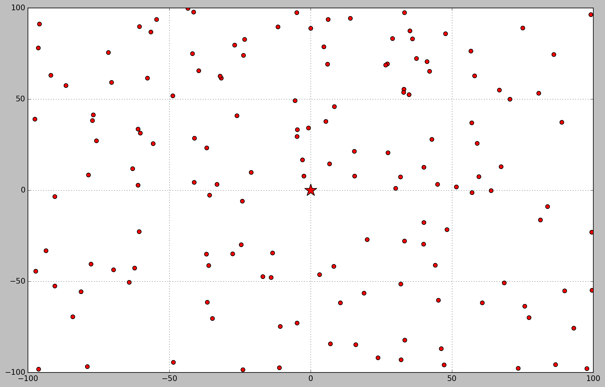


# Compute distance matrix


```python
distance_func = lambda a,b: np.sqrt((a.x-b.x)**2 + (a.y-b.y)**2)
def compute_distances(dfunc=distance_func):
    for i in range(size+1):
        current=data.iloc[i]
        data[i]=dfunc(current, data)
        #data[str(i)][i]=np.nan

%time compute_distances()
data
```

    CPU times: user 346 ms, sys: 5.93 ms, total: 352 ms
    Wall time: 357 ms


<div>
<style scoped>
    .dataframe tbody tr th:only-of-type {
        vertical-align: middle;
    }

    .dataframe tbody tr th {
        vertical-align: top;
    }

    .dataframe thead th {
        text-align: right;
    }
</style>
<table border="1" class="dataframe">
  <thead>
    <tr style="text-align: right;">
      <th></th>
      <th>x</th>
      <th>y</th>
      <th>0</th>
      <th>1</th>
      <th>2</th>
      <th>3</th>
      <th>4</th>
      <th>5</th>
      <th>6</th>
      <th>7</th>
      <th>...</th>
      <th>141</th>
      <th>142</th>
      <th>143</th>
      <th>144</th>
      <th>145</th>
      <th>146</th>
      <th>147</th>
      <th>148</th>
      <th>149</th>
      <th>150</th>
    </tr>
  </thead>
  <tbody>
    <tr>
      <th>0</th>
      <td>0.000000</td>
      <td>0.000000</td>
      <td>0.000000</td>
      <td>30.094619</td>
      <td>98.906970</td>
      <td>86.402846</td>
      <td>103.078947</td>
      <td>106.124389</td>
      <td>74.577630</td>
      <td>106.846484</td>
      <td>...</td>
      <td>59.528289</td>
      <td>48.525504</td>
      <td>79.048708</td>
      <td>88.182216</td>
      <td>69.747483</td>
      <td>60.216973</td>
      <td>61.156032</td>
      <td>26.391096</td>
      <td>73.713707</td>
      <td>64.129271</td>
    </tr>
    <tr>
      <th>1</th>
      <td>30.074848</td>
      <td>1.090675</td>
      <td>30.094619</td>
      <td>0.000000</td>
      <td>79.199277</td>
      <td>63.440275</td>
      <td>96.539672</td>
      <td>123.683115</td>
      <td>68.434599</td>
      <td>98.436519</td>
      <td>...</td>
      <td>58.616164</td>
      <td>68.857475</td>
      <td>108.921496</td>
      <td>82.214930</td>
      <td>96.802687</td>
      <td>44.383034</td>
      <td>91.180819</td>
      <td>25.020186</td>
      <td>67.768880</td>
      <td>93.714821</td>
    </tr>
    <tr>
      <th>2</th>
      <td>75.720294</td>
      <td>-63.631955</td>
      <td>98.906970</td>
      <td>79.199277</td>
      <td>0.000000</td>
      <td>113.781493</td>
      <td>166.719068</td>
      <td>128.062552</td>
      <td>141.682044</td>
      <td>42.996311</td>
      <td>...</td>
      <td>57.276463</td>
      <td>145.932898</td>
      <td>170.304863</td>
      <td>154.196790</td>
      <td>167.877766</td>
      <td>38.886864</td>
      <td>152.116365</td>
      <td>104.218532</td>
      <td>141.236354</td>
      <td>157.968538</td>
    </tr>
    <tr>
      <th>3</th>
      <td>70.446614</td>
      <td>50.027257</td>
      <td>86.402846</td>
      <td>63.440275</td>
      <td>113.781493</td>
      <td>0.000000</td>
      <td>60.390171</td>
      <td>187.123389</td>
      <td>47.464297</td>
      <td>147.701132</td>
      <td>...</td>
      <td>118.299618</td>
      <td>96.980912</td>
      <td>154.751471</td>
      <td>53.194391</td>
      <td>132.536951</td>
      <td>94.792692</td>
      <td>139.732470</td>
      <td>62.001337</td>
      <td>47.732738</td>
      <td>138.795084</td>
    </tr>
    <tr>
      <th>4</th>
      <td>33.220333</td>
      <td>97.579090</td>
      <td>103.078947</td>
      <td>96.539672</td>
      <td>166.719068</td>
      <td>60.390171</td>
      <td>0.000000</td>
      <td>208.633848</td>
      <td>28.765741</td>
      <td>193.924735</td>
      <td>...</td>
      <td>154.693357</td>
      <td>82.044400</td>
      <td>143.027539</td>
      <td>14.908663</td>
      <td>113.910385</td>
      <td>139.028595</td>
      <td>133.655082</td>
      <td>78.229684</td>
      <td>29.574281</td>
      <td>128.838562</td>
    </tr>
    <tr>
      <th>5</th>
      <td>-48.606315</td>
      <td>-94.338815</td>
      <td>106.124389</td>
      <td>123.683115</td>
      <td>128.062552</td>
      <td>187.123389</td>
      <td>208.633848</td>
      <td>0.000000</td>
      <td>180.468687</td>
      <td>95.852974</td>
      <td>...</td>
      <td>77.408944</td>
      <td>137.103775</td>
      <td>107.028154</td>
      <td>193.825565</td>
      <td>128.622553</td>
      <td>106.925989</td>
      <td>98.008518</td>
      <td>132.278609</td>
      <td>179.587519</td>
      <td>107.224850</td>
    </tr>
    <tr>
      <th>6</th>
      <td>27.143823</td>
      <td>69.462477</td>
      <td>74.577630</td>
      <td>68.434599</td>
      <td>141.682044</td>
      <td>47.464297</td>
      <td>28.765741</td>
      <td>180.468687</td>
      <td>0.000000</td>
      <td>166.517540</td>
      <td>...</td>
      <td>126.181957</td>
      <td>60.422310</td>
      <td>122.108842</td>
      <td>13.951546</td>
      <td>95.203204</td>
      <td>111.777718</td>
      <td>110.540955</td>
      <td>49.469965</td>
      <td>0.916230</td>
      <td>106.958325</td>
    </tr>
    <tr>
      <th>7</th>
      <td>47.234925</td>
      <td>-95.838578</td>
      <td>106.846484</td>
      <td>98.436519</td>
      <td>42.996311</td>
      <td>147.701132</td>
      <td>193.924735</td>
      <td>95.852974</td>
      <td>166.517540</td>
      <td>0.000000</td>
      <td>...</td>
      <td>48.524090</td>
      <td>155.169851</td>
      <td>163.402757</td>
      <td>180.068054</td>
      <td>168.837654</td>
      <td>54.904573</td>
      <td>146.552646</td>
      <td>121.463982</td>
      <td>165.901224</td>
      <td>154.159518</td>
    </tr>
    <tr>
      <th>8</th>
      <td>-77.679374</td>
      <td>-40.455252</td>
      <td>87.582604</td>
      <td>115.486087</td>
      <td>155.140639</td>
      <td>173.575323</td>
      <td>177.065594</td>
      <td>61.226474</td>
      <td>151.887491</td>
      <td>136.641483</td>
      <td>...</td>
      <td>97.890812</td>
      <td>96.330687</td>
      <td>48.864310</td>
      <td>163.348464</td>
      <td>75.969024</td>
      <td>121.760819</td>
      <td>46.394717</td>
      <td>111.798720</td>
      <td>150.972491</td>
      <td>54.384039</td>
    </tr>
    <tr>
      <th>9</th>
      <td>37.394038</td>
      <td>72.325211</td>
      <td>81.420208</td>
      <td>71.609564</td>
      <td>141.255984</td>
      <td>39.870685</td>
      <td>25.596449</td>
      <td>187.544551</td>
      <td>10.642469</td>
      <td>168.451485</td>
      <td>...</td>
      <td>130.096654</td>
      <td>70.846519</td>
      <td>132.443410</td>
      <td>13.851032</td>
      <td>105.784607</td>
      <td>113.546950</td>
      <td>120.509879</td>
      <td>55.456475</td>
      <td>11.415928</td>
      <td>117.179733</td>
    </tr>
    <tr>
      <th>10</th>
      <td>-60.273128</td>
      <td>31.437806</td>
      <td>67.979303</td>
      <td>95.308474</td>
      <td>165.929113</td>
      <td>132.034914</td>
      <td>114.523783</td>
      <td>126.316558</td>
      <td>95.328899</td>
      <td>166.605100</td>
      <td>...</td>
      <td>118.287542</td>
      <td>35.456251</td>
      <td>29.438717</td>
      <td>103.192151</td>
      <td>2.380087</td>
      <td>127.044938</td>
      <td>28.577853</td>
      <td>76.389427</td>
      <td>94.504923</td>
      <td>19.715298</td>
    </tr>
    <tr>
      <th>11</th>
      <td>39.931126</td>
      <td>-29.521506</td>
      <td>49.658978</td>
      <td>32.159786</td>
      <td>49.440745</td>
      <td>85.200944</td>
      <td>127.277634</td>
      <td>109.727672</td>
      <td>99.806534</td>
      <td>66.718059</td>
      <td>...</td>
      <td>34.170205</td>
      <td>96.543753</td>
      <td>124.450615</td>
      <td>113.353321</td>
      <td>119.151104</td>
      <td>12.228572</td>
      <td>106.086252</td>
      <td>56.493675</td>
      <td>99.196287</td>
      <td>110.970068</td>
    </tr>
    <tr>
      <th>12</th>
      <td>57.992110</td>
      <td>62.809588</td>
      <td>85.487596</td>
      <td>67.739189</td>
      <td>127.678315</td>
      <td>17.846642</td>
      <td>42.691441</td>
      <td>189.891666</td>
      <td>31.557530</td>
      <td>159.012444</td>
      <td>...</td>
      <td>125.504070</td>
      <td>86.902225</td>
      <td>147.030837</td>
      <td>35.549018</td>
      <td>122.582092</td>
      <td>104.762143</td>
      <td>133.314565</td>
      <td>59.370370</td>
      <td>32.004987</td>
      <td>131.272965</td>
    </tr>
    <tr>
      <th>13</th>
      <td>-60.515743</td>
      <td>89.891059</td>
      <td>108.363082</td>
      <td>126.854891</td>
      <td>205.254899</td>
      <td>136.895075</td>
      <td>94.050826</td>
      <td>184.614411</td>
      <td>90.008480</td>
      <td>214.722389</td>
      <td>...</td>
      <td>166.498686</td>
      <td>59.863977</td>
      <td>83.473428</td>
      <td>89.699398</td>
      <td>56.216213</td>
      <td>167.568594</td>
      <td>87.021354</td>
      <td>102.289533</td>
      <td>89.588215</td>
      <td>78.017229</td>
    </tr>
    <tr>
      <th>14</th>
      <td>-4.679923</td>
      <td>33.320070</td>
      <td>33.647120</td>
      <td>47.398608</td>
      <td>125.951935</td>
      <td>76.961852</td>
      <td>74.603291</td>
      <td>135.004884</td>
      <td>48.156250</td>
      <td>139.201679</td>
      <td>...</td>
      <td>92.813901</td>
      <td>22.727764</td>
      <td>78.008534</td>
      <td>60.234037</td>
      <td>56.399249</td>
      <td>88.908315</td>
      <td>64.101842</td>
      <td>23.400342</td>
      <td>47.240087</td>
      <td>62.136653</td>
    </tr>
    <tr>
      <th>15</th>
      <td>-57.737593</td>
      <td>61.505265</td>
      <td>84.359512</td>
      <td>106.587745</td>
      <td>182.948985</td>
      <td>128.697068</td>
      <td>97.850218</td>
      <td>156.111362</td>
      <td>85.253574</td>
      <td>189.146277</td>
      <td>...</td>
      <td>140.662914</td>
      <td>37.749133</td>
      <td>57.056254</td>
      <td>89.376138</td>
      <td>28.027384</td>
      <td>144.496514</td>
      <td>58.729353</td>
      <td>83.461441</td>
      <td>84.596487</td>
      <td>49.871252</td>
    </tr>
    <tr>
      <th>16</th>
      <td>-36.062776</td>
      <td>-41.212805</td>
      <td>54.763301</td>
      <td>78.509679</td>
      <td>114.009092</td>
      <td>140.246209</td>
      <td>155.123626</td>
      <td>54.586750</td>
      <td>127.452314</td>
      <td>99.611656</td>
      <td>...</td>
      <td>57.031756</td>
      <td>82.720230</td>
      <td>65.352699</td>
      <td>140.457750</td>
      <td>78.957867</td>
      <td>80.143110</td>
      <td>50.692451</td>
      <td>81.076899</td>
      <td>126.552884</td>
      <td>59.571347</td>
    </tr>
    <tr>
      <th>17</th>
      <td>-39.616364</td>
      <td>65.577880</td>
      <td>76.615369</td>
      <td>94.949802</td>
      <td>173.198517</td>
      <td>111.156111</td>
      <td>79.556659</td>
      <td>160.169188</td>
      <td>66.873109</td>
      <td>183.298716</td>
      <td>...</td>
      <td>135.330717</td>
      <td>28.129780</td>
      <td>69.203161</td>
      <td>70.810371</td>
      <td>38.447726</td>
      <td>135.533075</td>
      <td>66.280727</td>
      <td>70.603715</td>
      <td>66.239800</td>
      <td>58.542554</td>
    </tr>
    <tr>
      <th>18</th>
      <td>10.506738</td>
      <td>-61.664519</td>
      <td>62.553213</td>
      <td>65.735267</td>
      <td>65.243228</td>
      <td>126.758990</td>
      <td>160.855321</td>
      <td>67.542303</td>
      <td>132.178220</td>
      <td>50.167978</td>
      <td>...</td>
      <td>9.877943</td>
      <td>108.908434</td>
      <td>113.354726</td>
      <td>146.129710</td>
      <td>119.224623</td>
      <td>39.410315</td>
      <td>96.388788</td>
      <td>83.205405</td>
      <td>131.414712</td>
      <td>104.013969</td>
    </tr>
    <tr>
      <th>19</th>
      <td>42.851348</td>
      <td>27.974071</td>
      <td>51.174082</td>
      <td>29.765012</td>
      <td>97.324363</td>
      <td>35.324803</td>
      <td>70.268165</td>
      <td>152.725068</td>
      <td>44.362306</td>
      <td>123.890225</td>
      <td>...</td>
      <td>87.756612</td>
      <td>70.157849</td>
      <td>123.019616</td>
      <td>57.045691</td>
      <td>104.085773</td>
      <td>69.009729</td>
      <td>106.928212</td>
      <td>28.177386</td>
      <td>43.931320</td>
      <td>107.075533</td>
    </tr>
    <tr>
      <th>20</th>
      <td>6.640766</td>
      <td>14.505583</td>
      <td>15.953423</td>
      <td>27.002147</td>
      <td>104.295043</td>
      <td>73.027225</td>
      <td>87.222021</td>
      <td>122.062865</td>
      <td>58.656932</td>
      <td>117.574315</td>
      <td>...</td>
      <td>72.005774</td>
      <td>42.062065</td>
      <td>85.460217</td>
      <td>72.316444</td>
      <td>70.380430</td>
      <td>66.972524</td>
      <td>68.721275</td>
      <td>11.184979</td>
      <td>57.798040</td>
      <td>69.701862</td>
    </tr>
    <tr>
      <th>21</th>
      <td>-97.533493</td>
      <td>39.047596</td>
      <td>105.059492</td>
      <td>133.133829</td>
      <td>201.395046</td>
      <td>168.338555</td>
      <td>143.256758</td>
      <td>142.076751</td>
      <td>128.333542</td>
      <td>197.869084</td>
      <td>...</td>
      <td>150.583972</td>
      <td>71.453269</td>
      <td>36.023443</td>
      <td>133.992086</td>
      <td>36.848832</td>
      <td>162.683708</td>
      <td>51.351098</td>
      <td>114.357458</td>
      <td>127.589765</td>
      <td>43.908023</td>
    </tr>
    <tr>
      <th>22</th>
      <td>6.931842</td>
      <td>-84.173057</td>
      <td>84.458001</td>
      <td>88.348756</td>
      <td>71.789888</td>
      <td>148.471716</td>
      <td>183.643479</td>
      <td>56.460868</td>
      <td>154.959354</td>
      <td>41.957394</td>
      <td>...</td>
      <td>30.194834</td>
      <td>129.368139</td>
      <td>126.038572</td>
      <td>168.910884</td>
      <td>136.066655</td>
      <td>56.936572</td>
      <td>110.469669</td>
      <td>105.910143</td>
      <td>154.193375</td>
      <td>118.848436</td>
    </tr>
    <tr>
      <th>23</th>
      <td>-97.272500</td>
      <td>-44.429392</td>
      <td>106.938815</td>
      <td>135.238395</td>
      <td>174.055293</td>
      <td>192.488336</td>
      <td>192.859504</td>
      <td>69.709024</td>
      <td>168.673588</td>
      <td>153.379595</td>
      <td>...</td>
      <td>116.788665</td>
      <td>111.117040</td>
      <td>56.032174</td>
      <td>179.566372</td>
      <td>86.085715</td>
      <td>141.393610</td>
      <td>59.553834</td>
      <td>130.536369</td>
      <td>167.763931</td>
      <td>65.941462</td>
    </tr>
    <tr>
      <th>24</th>
      <td>99.477056</td>
      <td>-54.879872</td>
      <td>113.611114</td>
      <td>89.159232</td>
      <td>25.317636</td>
      <td>108.849770</td>
      <td>166.233837</td>
      <td>153.250426</td>
      <td>143.851022</td>
      <td>66.384153</td>
      <td>...</td>
      <td>80.596406</td>
      <td>157.941751</td>
      <td>188.987345</td>
      <td>155.139934</td>
      <td>183.358596</td>
      <td>57.103298</td>
      <td>170.635735</td>
      <td>113.479903</td>
      <td>143.553342</td>
      <td>175.682608</td>
    </tr>
    <tr>
      <th>25</th>
      <td>-78.996929</td>
      <td>-96.739844</td>
      <td>124.896406</td>
      <td>146.517791</td>
      <td>158.219947</td>
      <td>209.461105</td>
      <td>224.393766</td>
      <td>30.485314</td>
      <td>197.203121</td>
      <td>126.235072</td>
      <td>...</td>
      <td>105.859884</td>
      <td>147.458288</td>
      <td>105.140954</td>
      <td>209.914619</td>
      <td>131.642742</td>
      <td>135.100458</td>
      <td>101.208433</td>
      <td>151.249294</td>
      <td>196.296113</td>
      <td>109.823061</td>
    </tr>
    <tr>
      <th>26</th>
      <td>-31.674510</td>
      <td>61.639612</td>
      <td>69.301633</td>
      <td>86.482119</td>
      <td>165.004877</td>
      <td>102.779232</td>
      <td>74.182119</td>
      <td>156.894728</td>
      <td>59.336275</td>
      <td>176.142212</td>
      <td>...</td>
      <td>128.461820</td>
      <td>21.468972</td>
      <td>70.968457</td>
      <td>64.368608</td>
      <td>40.576327</td>
      <td>127.588116</td>
      <td>65.718093</td>
      <td>61.973721</td>
      <td>58.655820</td>
      <td>58.777123</td>
    </tr>
    <tr>
      <th>27</th>
      <td>-56.536075</td>
      <td>86.920994</td>
      <td>103.689859</td>
      <td>121.935621</td>
      <td>200.394455</td>
      <td>132.233699</td>
      <td>90.386990</td>
      <td>181.433181</td>
      <td>85.481724</td>
      <td>210.165367</td>
      <td>...</td>
      <td>162.003470</td>
      <td>55.167786</td>
      <td>81.561966</td>
      <td>85.553841</td>
      <td>53.436712</td>
      <td>162.768923</td>
      <td>84.172605</td>
      <td>97.346099</td>
      <td>85.042773</td>
      <td>75.286305</td>
    </tr>
    <tr>
      <th>28</th>
      <td>97.699575</td>
      <td>-97.796661</td>
      <td>138.236731</td>
      <td>119.799035</td>
      <td>40.624081</td>
      <td>150.315118</td>
      <td>205.740751</td>
      <td>146.346747</td>
      <td>181.531632</td>
      <td>50.502624</td>
      <td>...</td>
      <td>88.992079</td>
      <td>185.918792</td>
      <td>205.814807</td>
      <td>193.708387</td>
      <td>206.145160</td>
      <td>78.090334</td>
      <td>188.010037</td>
      <td>144.813096</td>
      <td>181.125415</td>
      <td>194.589012</td>
    </tr>
    <tr>
      <th>29</th>
      <td>56.980551</td>
      <td>37.072724</td>
      <td>67.979188</td>
      <td>44.929107</td>
      <td>102.433443</td>
      <td>18.685684</td>
      <td>65.004371</td>
      <td>168.575143</td>
      <td>44.037785</td>
      <td>133.268118</td>
      <td>...</td>
      <td>100.979544</td>
      <td>83.173313</td>
      <td>138.580254</td>
      <td>54.064519</td>
      <td>118.107395</td>
      <td>79.155743</td>
      <td>122.922888</td>
      <td>44.388740</td>
      <td>43.940802</td>
      <td>122.602601</td>
    </tr>
    <tr>
      <th>...</th>
      <td>...</td>
      <td>...</td>
      <td>...</td>
      <td>...</td>
      <td>...</td>
      <td>...</td>
      <td>...</td>
      <td>...</td>
      <td>...</td>
      <td>...</td>
      <td>...</td>
      <td>...</td>
      <td>...</td>
      <td>...</td>
      <td>...</td>
      <td>...</td>
      <td>...</td>
      <td>...</td>
      <td>...</td>
      <td>...</td>
      <td>...</td>
    </tr>
    <tr>
      <th>121</th>
      <td>89.841848</td>
      <td>-55.198411</td>
      <td>105.443930</td>
      <td>82.100886</td>
      <td>16.448190</td>
      <td>106.998208</td>
      <td>162.932381</td>
      <td>143.874477</td>
      <td>139.539885</td>
      <td>58.881007</td>
      <td>...</td>
      <td>70.956942</td>
      <td>150.597316</td>
      <td>180.049519</td>
      <td>151.294774</td>
      <td>175.144991</td>
      <td>47.906471</td>
      <td>161.716165</td>
      <td>106.770982</td>
      <td>139.190062</td>
      <td>166.938975</td>
    </tr>
    <tr>
      <th>122</th>
      <td>15.997366</td>
      <td>-84.731802</td>
      <td>86.228731</td>
      <td>86.969380</td>
      <td>63.340601</td>
      <td>145.343471</td>
      <td>183.122614</td>
      <td>65.314090</td>
      <td>154.596635</td>
      <td>33.153364</td>
      <td>...</td>
      <td>28.430318</td>
      <td>132.504217</td>
      <td>132.749649</td>
      <td>168.527388</td>
      <td>141.284883</td>
      <td>51.951419</td>
      <td>116.690174</td>
      <td>106.126929</td>
      <td>153.861518</td>
      <td>124.831864</td>
    </tr>
    <tr>
      <th>123</th>
      <td>57.065474</td>
      <td>-1.286114</td>
      <td>57.079966</td>
      <td>27.095074</td>
      <td>65.076925</td>
      <td>53.029397</td>
      <td>101.700144</td>
      <td>140.802458</td>
      <td>76.815809</td>
      <td>95.062127</td>
      <td>...</td>
      <td>67.081494</td>
      <td>93.259771</td>
      <td>136.011933</td>
      <td>89.137095</td>
      <td>123.208583</td>
      <td>41.806413</td>
      <td>118.227181</td>
      <td>47.391617</td>
      <td>76.412903</td>
      <td>120.801706</td>
    </tr>
    <tr>
      <th>124</th>
      <td>8.397404</td>
      <td>45.994062</td>
      <td>46.754360</td>
      <td>49.862068</td>
      <td>128.647717</td>
      <td>62.180150</td>
      <td>57.246772</td>
      <td>151.468612</td>
      <td>30.036557</td>
      <td>147.053904</td>
      <td>...</td>
      <td>102.980237</td>
      <td>34.874979</td>
      <td>94.773546</td>
      <td>42.586471</td>
      <td>70.558705</td>
      <td>94.050645</td>
      <td>81.779271</td>
      <td>25.592168</td>
      <td>29.120939</td>
      <td>79.125814</td>
    </tr>
    <tr>
      <th>125</th>
      <td>-95.971359</td>
      <td>91.328450</td>
      <td>132.481650</td>
      <td>155.017749</td>
      <td>231.280675</td>
      <td>171.466411</td>
      <td>129.342815</td>
      <td>191.613623</td>
      <td>125.041868</td>
      <td>235.668275</td>
      <td>...</td>
      <td>187.170662</td>
      <td>86.161684</td>
      <td>84.727760</td>
      <td>125.170250</td>
      <td>67.388112</td>
      <td>192.696071</td>
      <td>95.086406</td>
      <td>131.553313</td>
      <td>124.577837</td>
      <td>85.982245</td>
    </tr>
    <tr>
      <th>126</th>
      <td>33.324722</td>
      <td>-82.136313</td>
      <td>88.639219</td>
      <td>83.290415</td>
      <td>46.257927</td>
      <td>137.277982</td>
      <td>179.715433</td>
      <td>82.834751</td>
      <td>151.724741</td>
      <td>19.525516</td>
      <td>...</td>
      <td>29.461763</td>
      <td>136.642539</td>
      <td>143.959295</td>
      <td>165.492170</td>
      <td>149.414715</td>
      <td>42.495197</td>
      <td>127.044144</td>
      <td>105.061245</td>
      <td>151.056109</td>
      <td>134.634173</td>
    </tr>
    <tr>
      <th>127</th>
      <td>34.783261</td>
      <td>52.531436</td>
      <td>63.003389</td>
      <td>51.655794</td>
      <td>123.165636</td>
      <td>35.751163</td>
      <td>45.074759</td>
      <td>168.892546</td>
      <td>18.574746</td>
      <td>148.891587</td>
      <td>...</td>
      <td>110.133009</td>
      <td>61.987590</td>
      <td>121.669896</td>
      <td>31.316133</td>
      <td>97.697766</td>
      <td>94.016941</td>
      <td>107.969947</td>
      <td>36.649855</td>
      <td>18.205969</td>
      <td>105.895608</td>
    </tr>
    <tr>
      <th>128</th>
      <td>45.139227</td>
      <td>-60.250218</td>
      <td>75.283720</td>
      <td>63.163602</td>
      <td>30.767480</td>
      <td>113.144091</td>
      <td>158.278711</td>
      <td>99.750986</td>
      <td>130.955022</td>
      <td>35.650012</td>
      <td>...</td>
      <td>26.517063</td>
      <td>123.726290</td>
      <td>141.508196</td>
      <td>144.459031</td>
      <td>141.790525</td>
      <td>19.254651</td>
      <td>123.566617</td>
      <td>86.873475</td>
      <td>130.350663</td>
      <td>130.017410</td>
    </tr>
    <tr>
      <th>129</th>
      <td>35.987597</td>
      <td>83.219655</td>
      <td>90.667624</td>
      <td>82.341544</td>
      <td>152.131793</td>
      <td>47.845157</td>
      <td>14.623649</td>
      <td>196.680299</td>
      <td>16.354579</td>
      <td>179.411128</td>
      <td>...</td>
      <td>140.711171</td>
      <td>75.139046</td>
      <td>136.852089</td>
      <td>7.047020</td>
      <td>108.977736</td>
      <td>124.507642</td>
      <td>126.014265</td>
      <td>65.146838</td>
      <td>17.262478</td>
      <td>122.006644</td>
    </tr>
    <tr>
      <th>130</th>
      <td>67.314264</td>
      <td>13.003851</td>
      <td>68.558809</td>
      <td>39.098566</td>
      <td>77.095448</td>
      <td>37.155675</td>
      <td>91.188634</td>
      <td>157.987432</td>
      <td>69.290986</td>
      <td>110.679059</td>
      <td>...</td>
      <td>84.664752</td>
      <td>97.496483</td>
      <td>145.987959</td>
      <td>80.085853</td>
      <td>130.046105</td>
      <td>58.812516</td>
      <td>128.801988</td>
      <td>52.535424</td>
      <td>69.076799</td>
      <td>130.331715</td>
    </tr>
    <tr>
      <th>131</th>
      <td>-36.886862</td>
      <td>-35.034144</td>
      <td>50.872702</td>
      <td>76.084644</td>
      <td>116.181782</td>
      <td>136.952243</td>
      <td>150.004295</td>
      <td>60.451548</td>
      <td>122.553957</td>
      <td>103.796215</td>
      <td>...</td>
      <td>59.752355</td>
      <td>76.701618</td>
      <td>60.221539</td>
      <td>135.409580</td>
      <td>72.845897</td>
      <td>81.188287</td>
      <td>44.972966</td>
      <td>76.964773</td>
      <td>121.649555</td>
      <td>53.727826</td>
    </tr>
    <tr>
      <th>132</th>
      <td>42.068799</td>
      <td>65.334579</td>
      <td>77.707085</td>
      <td>65.353914</td>
      <td>133.284620</td>
      <td>32.243053</td>
      <td>33.436564</td>
      <td>183.623444</td>
      <td>15.485298</td>
      <td>161.255931</td>
      <td>...</td>
      <td>123.969250</td>
      <td>72.417874</td>
      <td>133.426864</td>
      <td>22.248948</td>
      <td>107.895462</td>
      <td>106.378312</td>
      <td>120.594648</td>
      <td>51.373083</td>
      <td>15.897325</td>
      <td>117.881047</td>
    </tr>
    <tr>
      <th>133</th>
      <td>-69.769883</td>
      <td>-43.590844</td>
      <td>82.267845</td>
      <td>109.386510</td>
      <td>146.864011</td>
      <td>168.597197</td>
      <td>174.745343</td>
      <td>54.984118</td>
      <td>148.907085</td>
      <td>128.140356</td>
      <td>...</td>
      <td>89.593395</td>
      <td>95.112353</td>
      <td>52.735908</td>
      <td>160.762448</td>
      <td>77.755833</td>
      <td>113.878913</td>
      <td>47.266508</td>
      <td>107.172530</td>
      <td>147.990855</td>
      <td>55.914424</td>
    </tr>
    <tr>
      <th>134</th>
      <td>33.143474</td>
      <td>-27.783041</td>
      <td>43.247974</td>
      <td>29.036321</td>
      <td>55.659054</td>
      <td>86.290015</td>
      <td>125.362154</td>
      <td>105.416788</td>
      <td>97.430420</td>
      <td>69.499101</td>
      <td>...</td>
      <td>32.011960</td>
      <td>90.710902</td>
      <td>117.456747</td>
      <td>111.160293</td>
      <td>112.494937</td>
      <td>17.174169</td>
      <td>99.092814</td>
      <td>52.261883</td>
      <td>96.775793</td>
      <td>104.028296</td>
    </tr>
    <tr>
      <th>135</th>
      <td>-41.797934</td>
      <td>75.064175</td>
      <td>85.916806</td>
      <td>103.139593</td>
      <td>181.788752</td>
      <td>115.002981</td>
      <td>78.324082</td>
      <td>169.539751</td>
      <td>69.168959</td>
      <td>192.703401</td>
      <td>...</td>
      <td>144.843457</td>
      <td>37.590972</td>
      <td>76.148121</td>
      <td>71.216505</td>
      <td>45.657050</td>
      <td>144.401073</td>
      <td>74.725486</td>
      <td>78.474180</td>
      <td>68.633958</td>
      <td>66.618645</td>
    </tr>
    <tr>
      <th>136</th>
      <td>5.324715</td>
      <td>37.861594</td>
      <td>38.234185</td>
      <td>44.324593</td>
      <td>123.517116</td>
      <td>66.248509</td>
      <td>65.911644</td>
      <td>142.777814</td>
      <td>38.401684</td>
      <td>140.114958</td>
      <td>...</td>
      <td>95.282659</td>
      <td>31.576193</td>
      <td>88.946645</td>
      <td>51.207196</td>
      <td>66.534434</td>
      <td>87.892156</td>
      <td>75.066808</td>
      <td>19.333251</td>
      <td>37.490693</td>
      <td>73.097992</td>
    </tr>
    <tr>
      <th>137</th>
      <td>68.512768</td>
      <td>-50.739106</td>
      <td>85.255242</td>
      <td>64.527513</td>
      <td>14.770714</td>
      <td>100.784918</td>
      <td>152.459316</td>
      <td>124.971254</td>
      <td>127.121243</td>
      <td>49.866912</td>
      <td>...</td>
      <td>49.944368</td>
      <td>131.723944</td>
      <td>158.555876</td>
      <td>139.756261</td>
      <td>154.660813</td>
      <td>26.293040</td>
      <td>140.251971</td>
      <td>89.545938</td>
      <td>126.661060</td>
      <td>145.685918</td>
    </tr>
    <tr>
      <th>138</th>
      <td>-64.144841</td>
      <td>-50.464696</td>
      <td>81.616458</td>
      <td>107.402542</td>
      <td>140.483568</td>
      <td>167.968724</td>
      <td>177.191816</td>
      <td>46.544432</td>
      <td>150.718768</td>
      <td>120.267375</td>
      <td>...</td>
      <td>83.256175</td>
      <td>98.972952</td>
      <td>60.614178</td>
      <td>162.964343</td>
      <td>84.198224</td>
      <td>108.635878</td>
      <td>53.423778</td>
      <td>107.235560</td>
      <td>149.804162</td>
      <td>62.388769</td>
    </tr>
    <tr>
      <th>139</th>
      <td>-26.845766</td>
      <td>79.781956</td>
      <td>84.177525</td>
      <td>97.119896</td>
      <td>176.316042</td>
      <td>101.740598</td>
      <td>62.647221</td>
      <td>175.475253</td>
      <td>54.966966</td>
      <td>190.605668</td>
      <td>...</td>
      <td>143.705771</td>
      <td>38.883215</td>
      <td>88.169982</td>
      <td>55.897455</td>
      <td>57.423469</td>
      <td>140.088304</td>
      <td>84.188922</td>
      <td>72.099782</td>
      <td>54.516591</td>
      <td>76.903493</td>
    </tr>
    <tr>
      <th>140</th>
      <td>0.068680</td>
      <td>88.957681</td>
      <td>88.957708</td>
      <td>92.849238</td>
      <td>170.313722</td>
      <td>80.427803</td>
      <td>34.254355</td>
      <td>189.649310</td>
      <td>33.363548</td>
      <td>190.720508</td>
      <td>...</td>
      <td>146.621116</td>
      <td>54.717565</td>
      <td>112.598467</td>
      <td>29.421860</td>
      <td>82.430589</td>
      <td>137.231302</td>
      <td>105.598414</td>
      <td>69.293345</td>
      <td>33.297406</td>
      <td>99.574313</td>
    </tr>
    <tr>
      <th>141</th>
      <td>18.895939</td>
      <td>-56.449630</td>
      <td>59.528289</td>
      <td>58.616164</td>
      <td>57.276463</td>
      <td>118.299618</td>
      <td>154.693357</td>
      <td>77.408944</td>
      <td>126.181957</td>
      <td>48.524090</td>
      <td>...</td>
      <td>0.000000</td>
      <td>107.252558</td>
      <td>117.094805</td>
      <td>140.107971</td>
      <td>120.493838</td>
      <td>29.532534</td>
      <td>99.581774</td>
      <td>77.919459</td>
      <td>125.450782</td>
      <td>106.689342</td>
    </tr>
    <tr>
      <th>142</th>
      <td>-26.104390</td>
      <td>40.905810</td>
      <td>48.525504</td>
      <td>68.857475</td>
      <td>145.932898</td>
      <td>96.980912</td>
      <td>82.044400</td>
      <td>137.103775</td>
      <td>60.422310</td>
      <td>155.169851</td>
      <td>...</td>
      <td>107.252558</td>
      <td>0.000000</td>
      <td>61.745510</td>
      <td>69.477160</td>
      <td>35.712774</td>
      <td>107.881768</td>
      <td>51.676834</td>
      <td>45.910194</td>
      <td>59.568512</td>
      <td>46.933719</td>
    </tr>
    <tr>
      <th>143</th>
      <td>-78.601095</td>
      <td>8.400365</td>
      <td>79.048708</td>
      <td>108.921496</td>
      <td>170.304863</td>
      <td>154.751471</td>
      <td>143.027539</td>
      <td>107.028154</td>
      <td>122.108842</td>
      <td>163.402757</td>
      <td>...</td>
      <td>117.094805</td>
      <td>61.745510</td>
      <td>0.000000</td>
      <td>131.053150</td>
      <td>30.757098</td>
      <td>132.263062</td>
      <td>18.364522</td>
      <td>94.947451</td>
      <td>121.244564</td>
      <td>15.979246</td>
    </tr>
    <tr>
      <th>144</th>
      <td>28.941010</td>
      <td>83.297786</td>
      <td>88.182216</td>
      <td>82.214930</td>
      <td>154.196790</td>
      <td>53.194391</td>
      <td>14.908663</td>
      <td>193.825565</td>
      <td>13.951546</td>
      <td>180.068054</td>
      <td>...</td>
      <td>140.107971</td>
      <td>69.477160</td>
      <td>131.053150</td>
      <td>0.000000</td>
      <td>102.789037</td>
      <td>125.240877</td>
      <td>120.721578</td>
      <td>63.356419</td>
      <td>14.726106</td>
      <td>116.409592</td>
    </tr>
    <tr>
      <th>145</th>
      <td>-61.078038</td>
      <td>33.677658</td>
      <td>69.747483</td>
      <td>96.802687</td>
      <td>167.877766</td>
      <td>132.536951</td>
      <td>113.910385</td>
      <td>128.622553</td>
      <td>95.203204</td>
      <td>168.837654</td>
      <td>...</td>
      <td>120.493838</td>
      <td>35.712774</td>
      <td>30.757098</td>
      <td>102.789037</td>
      <td>0.000000</td>
      <td>128.991014</td>
      <td>30.806070</td>
      <td>77.510705</td>
      <td>94.389526</td>
      <td>21.849691</td>
    </tr>
    <tr>
      <th>146</th>
      <td>44.080113</td>
      <td>-41.024718</td>
      <td>60.216973</td>
      <td>44.383034</td>
      <td>38.886864</td>
      <td>94.792692</td>
      <td>139.028595</td>
      <td>106.925989</td>
      <td>111.777718</td>
      <td>54.904573</td>
      <td>...</td>
      <td>29.532534</td>
      <td>107.881768</td>
      <td>132.263062</td>
      <td>125.240877</td>
      <td>128.991014</td>
      <td>0.000000</td>
      <td>113.962007</td>
      <td>68.670000</td>
      <td>111.183576</td>
      <td>119.462961</td>
    </tr>
    <tr>
      <th>147</th>
      <td>-61.088577</td>
      <td>2.871590</td>
      <td>61.156032</td>
      <td>91.180819</td>
      <td>152.116365</td>
      <td>139.732470</td>
      <td>133.655082</td>
      <td>98.008518</td>
      <td>110.540955</td>
      <td>146.552646</td>
      <td>...</td>
      <td>99.581774</td>
      <td>51.676834</td>
      <td>18.364522</td>
      <td>120.721578</td>
      <td>30.806070</td>
      <td>113.962007</td>
      <td>0.000000</td>
      <td>78.750857</td>
      <td>109.645851</td>
      <td>9.244708</td>
    </tr>
    <tr>
      <th>148</th>
      <td>15.453097</td>
      <td>21.393731</td>
      <td>26.391096</td>
      <td>25.020186</td>
      <td>104.218532</td>
      <td>62.001337</td>
      <td>78.229684</td>
      <td>132.278609</td>
      <td>49.469965</td>
      <td>121.463982</td>
      <td>...</td>
      <td>77.919459</td>
      <td>45.910194</td>
      <td>94.947451</td>
      <td>63.356419</td>
      <td>77.510705</td>
      <td>68.670000</td>
      <td>78.750857</td>
      <td>0.000000</td>
      <td>48.655456</td>
      <td>79.036577</td>
    </tr>
    <tr>
      <th>149</th>
      <td>26.546590</td>
      <td>68.767646</td>
      <td>73.713707</td>
      <td>67.768880</td>
      <td>141.236354</td>
      <td>47.732738</td>
      <td>29.574281</td>
      <td>179.587519</td>
      <td>0.916230</td>
      <td>165.901224</td>
      <td>...</td>
      <td>125.450782</td>
      <td>59.568512</td>
      <td>121.244564</td>
      <td>14.726106</td>
      <td>94.389526</td>
      <td>111.183576</td>
      <td>109.645851</td>
      <td>48.655456</td>
      <td>0.000000</td>
      <td>106.081385</td>
    </tr>
    <tr>
      <th>150</th>
      <td>-63.012893</td>
      <td>11.913804</td>
      <td>64.129271</td>
      <td>93.714821</td>
      <td>157.968538</td>
      <td>138.795084</td>
      <td>128.838562</td>
      <td>107.224850</td>
      <td>106.958325</td>
      <td>154.159518</td>
      <td>...</td>
      <td>106.689342</td>
      <td>46.933719</td>
      <td>15.979246</td>
      <td>116.409592</td>
      <td>21.849691</td>
      <td>119.462961</td>
      <td>9.244708</td>
      <td>79.036577</td>
      <td>106.081385</td>
      <td>0.000000</td>
    </tr>
  </tbody>
</table>
<p>151 rows × 153 columns</p>
</div>


## Helper functions


```python
estimate_cost = lambda route: sum(data.iloc[i][j] for i,j in zip(route, route[1:]))
get_coords = lambda route: list(zip(*[(data.iloc[i].x,data.iloc[i].y) for i in route]))
```

# Scenario: center depot, one van, nearest neighbor heuristic

## Apply a greedy NN algorithm


```python
def nearest_neighbor(unserved, stop_condition=lambda route, target: False):
    current=0 #depot
    result_path=[]
    while True:
        result_path.append(current)
        unserved.remove(current)
        if not unserved:
            break

        current=data.iloc[unserved,current+2].idxmin()
        if stop_condition(result_path, int(current)):
            if len(result_path)>1:
                break

    result_path.append(0)
    return result_path

%time route = nearest_neighbor(list(range(size+1)))
print('cost={}\nroute={}'.format(estimate_cost(route),route))
```

    CPU times: user 116 ms, sys: 8.29 ms, total: 125 ms
    Wall time: 122 ms
    cost=2623.828598616268
    route=[0, 53, 60, 20, 66, 148, 55, 51, 1, 120, 104, 123, 74, 93, 130, 42, 29, 19, 91, 107, 81, 11, 134, 117, 57, 30, 34, 67, 75, 46, 39, 131, 16, 114, 72, 96, 38, 22, 122, 92, 36, 126, 113, 7, 58, 111, 28, 108, 63, 2, 137, 50, 128, 69, 141, 18, 146, 37, 54, 95, 24, 121, 35, 83, 3, 49, 12, 73, 105, 129, 90, 144, 9, 86, 132, 31, 70, 127, 149, 6, 71, 41, 140, 76, 102, 32, 100, 97, 139, 88, 78, 26, 17, 135, 27, 13, 110, 89, 59, 119, 40, 15, 56, 145, 10, 106, 82, 94, 115, 87, 98, 44, 64, 52, 14, 33, 136, 124, 65, 142, 150, 147, 143, 109, 112, 23, 47, 101, 45, 138, 99, 133, 8, 48, 62, 80, 103, 43, 68, 61, 125, 21, 25, 118, 5, 79, 116, 77, 85, 84, 4, 0]


## Plot result path


```python
coords=get_coords(route)
plt.plot(coords[0], coords[1], 'b-', linewidth=2)
plt.scatter(data.x, data.y, c='r', s=30)
plt.scatter(data.iloc[0].x, data.iloc[0].y, marker='*', c='r', s=400)
plt.axis([-100,100,-100,100])
plt.grid(True)
```


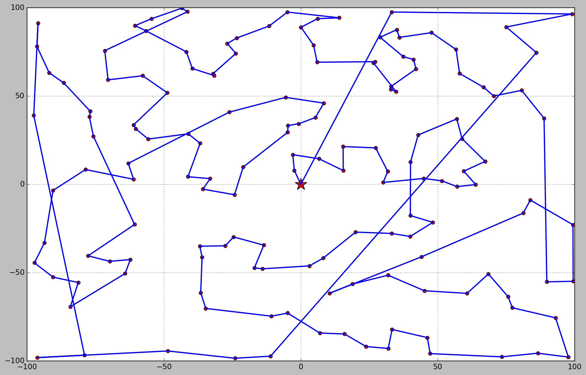


## Let's improve it with a 2-opt heuristic


```python
def twoOptSwap(route,i,j):
    t=route[i:j+1];
    t.reverse();
    route[i:j+1]=t

def twoOpt(route):
    cost=estimate_cost(route)

    def inner():
        nonlocal cost
        for i in range(1,len(route)-2):
            nodei=data.iloc[route[i]]
            for j in range(i+1,len(route)-1):
                nodej=data.iloc[route[j]]
                save=nodei.iloc[route[i-1]+2]+nodej.iloc[route[j+1]+2] - (nodej.iloc[route[i-1]+2]+nodei.iloc[route[j+1]+2])
                if save>0:
                    twoOptSwap(route,i,j)

                    cost-=save
                    print('exchanging {}-{},{}-{} with {}-{},{}-{} => save={} => cost: {}'.format(
                            route[i-1],route[i],route[j],route[j+1],route[i-1],route[j],route[i],route[j+1],save,cost))
                    return False
        return True

    while True:
        if inner():
            break

%time twoOpt(route)
```

    exchanging 53-64,60-52 with 53-60,64-52 => save=2.8803537373675177 => cost: 2620.948244878901
    ...
    exchanging 1-120,81-107 with 1-81,120-107 => save=26.496627104257605 => cost: 2100.7350743873462
    CPU times: user 3min 11s, sys: 1.65 s, total: 3min 13s
    Wall time: 3min 21s


## Plot improved path


```python
coords=get_coords(route)
plt.plot(coords[0], coords[1], 'b-', linewidth=2)
plt.scatter(data.x, data.y, c='r', s=30)
plt.scatter(data.iloc[0].x, data.iloc[0].y, marker='*', c='r', s=400)
plt.axis([-100,100,-100,100])
plt.grid(True)
```


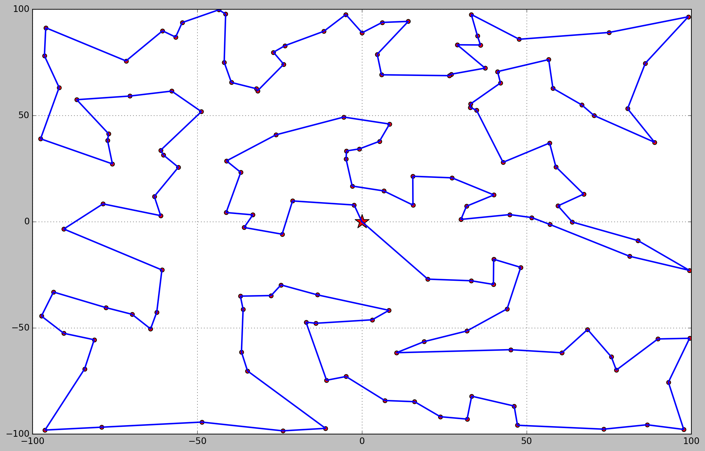


## Incredible! A clean path, without any crossing parts!

# Scenario: center depot, one van, 2-opt heuristic

## Just for fun, let's pass a random route to 2-opt heuristic


```python
route = [x for x in range(size+1)]+[0]
print('cost={}\nroute={}'.format(estimate_cost(route),route))
```

    cost=16332.039263088578
    route=[0, 1, 2, 3, 4, 5, 6, 7, 8, 9, 10, 11, 12, 13, 14, 15, 16, 17, 18, 19, 20, 21, 22, 23, 24, 25, 26, 27, 28, 29, 30, 31, 32, 33, 34, 35, 36, 37, 38, 39, 40, 41, 42, 43, 44, 45, 46, 47, 48, 49, 50, 51, 52, 53, 54, 55, 56, 57, 58, 59, 60, 61, 62, 63, 64, 65, 66, 67, 68, 69, 70, 71, 72, 73, 74, 75, 76, 77, 78, 79, 80, 81, 82, 83, 84, 85, 86, 87, 88, 89, 90, 91, 92, 93, 94, 95, 96, 97, 98, 99, 100, 101, 102, 103, 104, 105, 106, 107, 108, 109, 110, 111, 112, 113, 114, 115, 116, 117, 118, 119, 120, 121, 122, 123, 124, 125, 126, 127, 128, 129, 130, 131, 132, 133, 134, 135, 136, 137, 138, 139, 140, 141, 142, 143, 144, 145, 146, 147, 148, 149, 150, 0]


## Plot result path


```python
coords=get_coords(route)
plt.plot(coords[0], coords[1], 'b-', linewidth=2)
plt.scatter(data.x, data.y, c='r', s=30)
plt.scatter(data.iloc[0].x, data.iloc[0].y, marker='*', c='r', s=400)
plt.axis([-100,100,-100,100])
plt.grid(True)
```


## Let's see what 2-opt heuristic can do


```python
%time twoOpt(route)
```

    exchanging 0-4,1-5 with 0-1,4-5 => save=11.966404491447804 => cost: 16320.07285859713
    ...
    exchanging 47-23,112-8 with 47-112,23-8 => save=11.556726776627453 => cost: 2181.5435075388827
    CPU times: user 19min 11s, sys: 8.18 s, total: 19min 19s
    Wall time: 19min 44s


## Plot improved path


```python
coords=get_coords(route)
plt.plot(coords[0], coords[1], 'b-', linewidth=2)
plt.scatter(data.x, data.y, c='r', s=30)
plt.scatter(data.iloc[0].x, data.iloc[0].y, marker='*', c='r', s=400)
plt.axis([-100,100,-100,100])
plt.grid(True)
```


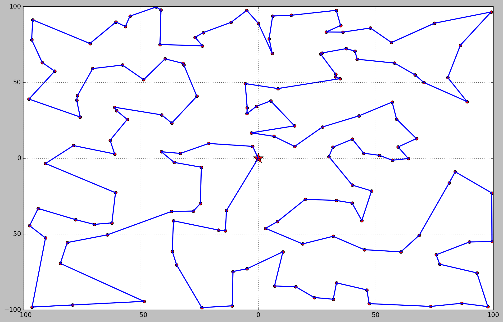


## WOW, very cool, a clean path too, almost as good as the previous one.

## But extremely slower... It took ~19 minutes, while NN + 2-opt took only ~3 minutes.

# Scenario: center depot, several vans, no clustering

## Let's apply a sequential NN algorithm, but including a max cost constraint


```python
def sequential_nn(max_cost):
    unserved=list(range(size+1))
    result=[]
    while True:
        result_path = nearest_neighbor(unserved, lambda route, target: estimate_cost(route+[target,0])>=max_cost)
        result.append(result_path)
        print('van {}: {}'.format(len(result), estimate_cost(result_path)))

        if not unserved:
            break
        unserved.append(0)
    return result

%time result_paths = sequential_nn(400)
```

    van 1: 389.0742611200774
    van 2: 398.3533734081084
    van 3: 397.4195886051539
    van 4: 390.9917686566429
    van 5: 371.6762623788105
    van 6: 320.29683749922486
    van 7: 364.8394134778564
    van 8: 320.99556479051967
    van 9: 210.1189842618746
    van 10: 276.59421133431306
    CPU times: user 1.48 s, sys: 24.4 ms, total: 1.51 s
    Wall time: 1.54 s


## Plot result paths


```python
for path in result_paths:
    coords=get_coords(path)
    plt.plot(coords[0], coords[1], linewidth=2)
plt.scatter(data.x, data.y, c='r', s=30)
plt.scatter(data.iloc[0].x, data.iloc[0].y, marker='*', c='r', s=400)
plt.axis([-100,100,-100,100])
plt.grid(True)
```


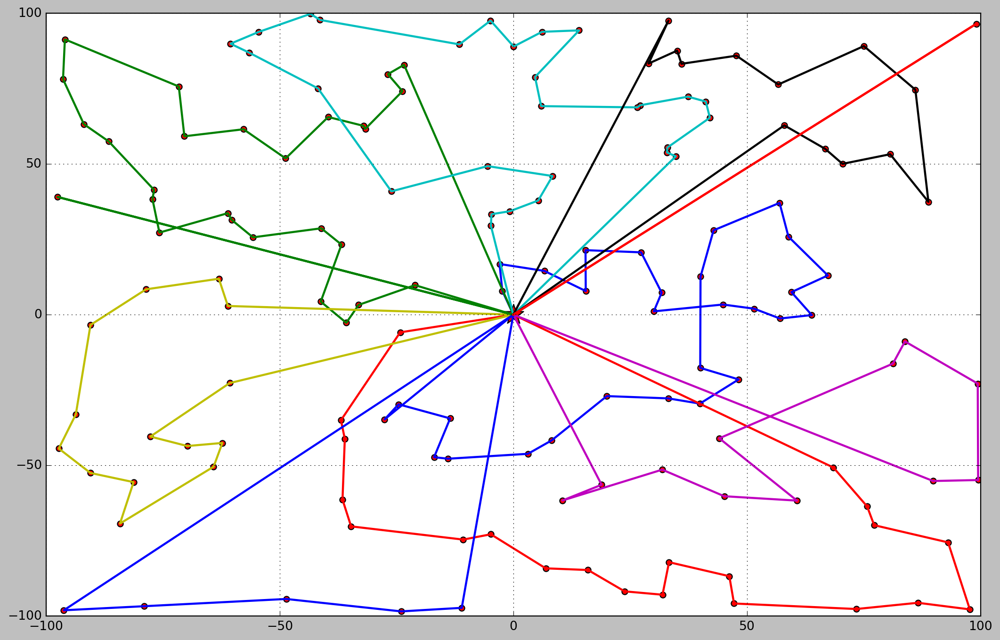


## Let's improve them with a 2-opt heuristic


```python
def improve_seq_nn():
    for i,path in enumerate(result_paths):
        print('Starting path {}/{}'.format(i+1, len(result_paths)))
        twoOpt(path)

%time improve_seq_nn()
```

    Starting path 1/10
    exchanging 55-19,51-91 with 55-51,19-91 => save=2.6873147586143844 => cost: 386.386946361463
    ...
    exchanging 67-39,75-0 with 67-75,39-0 => save=4.275672113835263 => cost: 368.50842741951476
    Starting path 2/10
    exchanging 17-97,78-0 with 17-78,97-0 => save=0.09782392307953103 => cost: 398.25554948502884
    ...
    exchanging 88-78,26-0 with 88-26,78-0 => save=1.6805548383893267 => cost: 394.249851279636
    Starting path 3/10
    Starting path 4/10
    exchanging 124-127,65-0 with 124-65,127-0 => save=0.5258127779938491 => cost: 390.465955878649
    exchanging 14-65,33-0 with 14-33,65-0 => save=3.343148155406432 => cost: 387.1228077232426
    Starting path 5/10
    exchanging 0-18,141-69 with 0-141,18-69 => save=6.7520080457503155 => cost: 364.9242543330602
    exchanging 50-121,146-0 with 50-146,121-0 => save=41.908681513869396 => cost: 323.0155728191908
    Starting path 6/10
    exchanging 47-45,101-138 with 47-101,45-138 => save=1.4275147235708587 => cost: 318.869322775654
    Starting path 7/10
    exchanging 3-35,83-77 with 3-83,35-77 => save=3.633104522812438 => cost: 361.20630895504394
    ...
    exchanging 90-129,144-0 with 90-144,129-0 => save=5.489882024385494 => cost: 347.690672350374
    Starting path 8/10
    Starting path 9/10
    Starting path 10/10
    CPU times: user 3.25 s, sys: 37.7 ms, total: 3.29 s
    Wall time: 3.31 s


## Plot improved paths


```python
for path in result_paths:
    coords=get_coords(path)
    plt.plot(coords[0], coords[1], linewidth=2)
plt.scatter(data.x, data.y, c='r', s=30)
plt.scatter(data.iloc[0].x, data.iloc[0].y, marker='*', c='r', s=400)
plt.axis([-100,100,-100,100])
plt.grid(True)
```


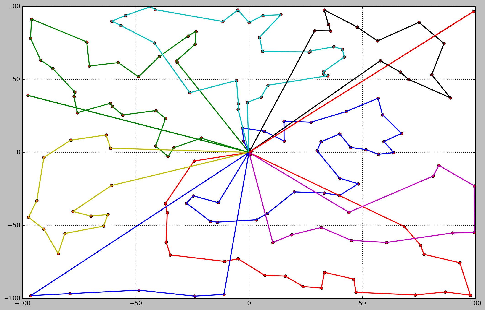


## Great! Several clean paths, but with many superpositions, let's improve them once more.

# Scenario: center depot, several vans, KMeans clustering

## Compute delivery clusters


```python
from sklearn.cluster import KMeans

work_per_van=20 #how many deliveries each van will start, ie granularity; a better approach would be capacity.
model = KMeans(n_clusters=1+size//work_per_van, init='k-means++', random_state=0)
%time model.fit(data[['x', 'y']])
```

    CPU times: user 75.7 ms, sys: 4.05 ms, total: 79.7 ms
    Wall time: 92.8 ms


    KMeans(algorithm='auto', copy_x=True, init='k-means++', max_iter=300,
        n_clusters=8, n_init=10, n_jobs=1, precompute_distances='auto',
        random_state=0, tol=0.0001, verbose=0)


## Plot clusters


```python
plt.scatter(data.x, data.y, marker='o', c=model.labels_, s=200)
plt.scatter(model.cluster_centers_[:,0], model.cluster_centers_[:,1], marker='+', c='r', s=500)
plt.scatter(data.iloc[0].x, data.iloc[0].y, marker='*', c='r', s=400)
plt.axis([-100,100,-100,100])
plt.grid(True)
```


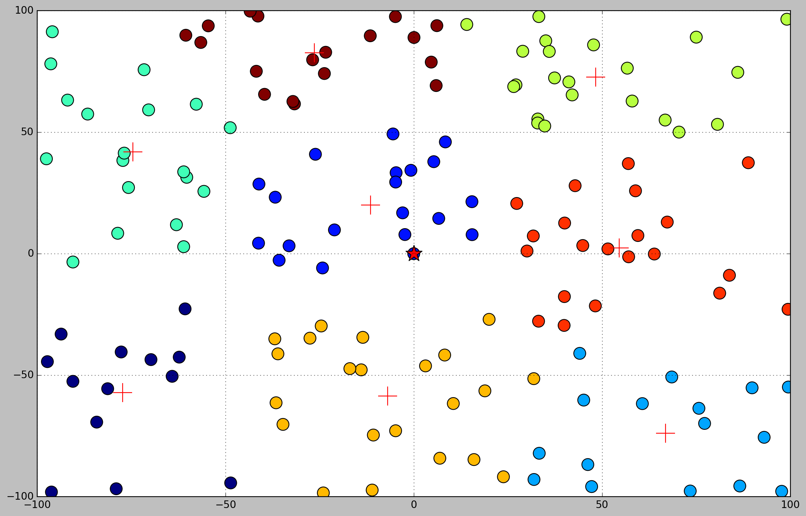


## Let's apply a greedy NN algorithm sequentially, on each of the clusters


```python
def greedy_nn_clusters():
    result=[]
    for i in range(model.n_clusters):
        unserved=data[model.labels_ == i].index.tolist()
        if 0 not in unserved:
            unserved.append(0)
        result_path = nearest_neighbor(unserved)
        result.append(result_path)
        print('van {}: {}'.format(i+1, estimate_cost(result_path)))
    return result

%time result_paths = greedy_nn_clusters()
```

    van 1: 409.3080162039939
    van 2: 266.4745473994821
    van 3: 413.3606064604762
    van 4: 446.80922078430706
    van 5: 457.66477785115126
    van 6: 455.80304195030294
    van 7: 459.76894476196577
    van 8: 376.5008949566861
    CPU times: user 164 ms, sys: 10.1 ms, total: 174 ms
    Wall time: 174 ms


## Plot result paths


```python
plt.scatter(data.x, data.y, marker='o', c=model.labels_, s=200)
plt.scatter(model.cluster_centers_[:,0], model.cluster_centers_[:,1], marker='+', c='r', s=500)
for path in result_paths:
    coords=get_coords(path)
    plt.plot(coords[0], coords[1], 'k-', linewidth=2)
plt.scatter(data.iloc[0].x, data.iloc[0].y, marker='*', c='r', s=400)
plt.axis([-100,100,-100,100])
plt.grid(True)
```


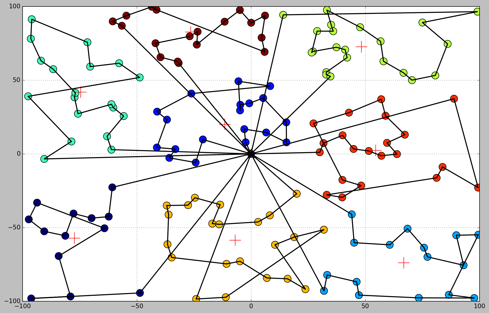


## Let's improve them with a 2-opt heuristic


```python
def improve_result_paths():
    for i, path in enumerate(result_paths):
        print('Starting path {}/{}'.format(i+1, len(result_paths)))
        twoOpt(path)

%time improve_result_paths()
```

    Starting path 1/8
    exchanging 48-112,99-138 with 48-99,112-138 => save=11.5162692633929 => cost: 397.791746940601
    exchanging 45-118,25-5 with 45-25,118-5 => save=13.984640981159586 => cost: 383.8071059594414
    Starting path 2/8
    exchanging 148-52,136-65 with 148-136,52-65 => save=1.6057804518926915 => cost: 264.8687669475894
    exchanging 148-124,52-142 with 148-52,124-142 => save=6.904413311483367 => cost: 257.964353636106
    Starting path 3/8
    exchanging 63-24,108-111 with 63-108,24-111 => save=11.657922849361384 => cost: 401.7026836111148
    ...
    exchanging 113-36,126-0 with 113-126,36-0 => save=7.772149456496223 => cost: 378.1902685773841
    Starting path 4/8
    exchanging 147-109,150-0 with 147-150,109-0 => save=5.601665728075147 => cost: 441.2075550562319
    ...
    exchanging 62-109,143-150 with 62-143,109-150 => save=0.5147852919035643 => cost: 394.93412566866925
    Starting path 5/8
    exchanging 9-149,6-144 with 9-6,149-144 => save=0.0011015802705607314 => cost: 457.66367627088067
    ...
    exchanging 105-129,144-90 with 105-144,129-90 => save=3.918490824545831 => cost: 407.2051777421843
    Starting path 6/8
    exchanging 30-69,34-116 with 30-34,69-116 => save=1.1688372549307786 => cost: 454.63420469537215
    ...
    exchanging 22-116,79-38 with 22-79,116-38 => save=5.039989423215701 => cost: 380.39750649818404
    Starting path 7/8
    exchanging 0-55,1-107 with 0-1,55-107 => save=14.962441964752642 => cost: 444.8065027972131
    ...
    exchanging 0-107,55-42 with 0-55,107-42 => save=6.044195398723886 => cost: 403.197665386089
    Starting path 8/8
    exchanging 0-71,26-59 with 0-26,71-59 => save=17.738760993960298 => cost: 358.76213396272584
    ...
    exchanging 17-78,26-88 with 17-26,78-88 => save=0.17155006280330554 => cost: 319.53217682612376
    CPU times: user 2.81 s, sys: 64.8 ms, total: 2.87 s
    Wall time: 3.03 s


## Plot improved paths


```python
plt.scatter(data.x, data.y, marker='o', c=model.labels_, s=200)
plt.scatter(model.cluster_centers_[:,0], model.cluster_centers_[:,1], marker='+', c='r', s=500)
for path in result_paths:
    coords=get_coords(path)
    plt.plot(coords[0], coords[1], 'k-', linewidth=2)
plt.scatter(data.iloc[0].x, data.iloc[0].y, marker='*', c='r', s=400)
plt.axis([-100,100,-100,100])
plt.grid(True)
```


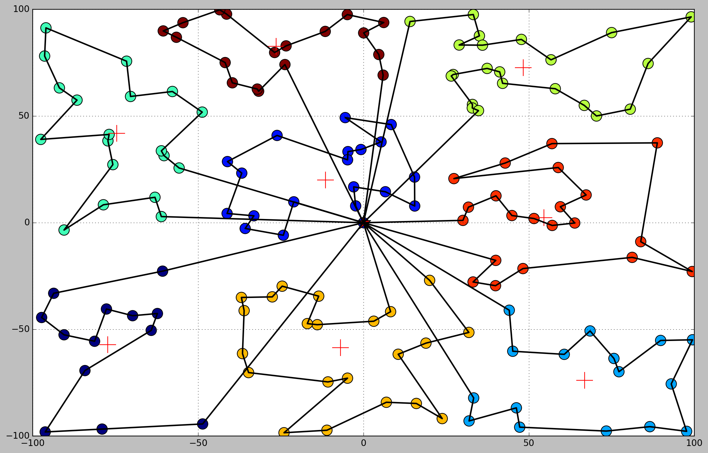


## Cool clean paths, with clearly defined cluster subsections!

# Let's change the depot to the farthest point

## Find farthest point and set it as new depot


```python
maxid=data[0].idxmax()
print('farthest point={}; distance={}; coords={}'.format(maxid, data.iloc[maxid,2], tuple(data.iloc[maxid][['x','y']].tolist())))
data.drop(data.columns.difference(['x', 'y']), axis=1, inplace=True)
data.iloc[0]=data.iloc[maxid]
data.drop(maxid, inplace=True)
data.reset_index(drop=True, inplace=True)
size-=1
data
```

    farthest point=84; distance=138.29710566715653; coords=(99.07656719022526, 96.48794364952255)


<div>
<style scoped>
    .dataframe tbody tr th:only-of-type {
        vertical-align: middle;
    }

    .dataframe tbody tr th {
        vertical-align: top;
    }

    .dataframe thead th {
        text-align: right;
    }
</style>
<table border="1" class="dataframe">
  <thead>
    <tr style="text-align: right;">
      <th></th>
      <th>x</th>
      <th>y</th>
    </tr>
  </thead>
  <tbody>
    <tr>
      <th>0</th>
      <td>99.076567</td>
      <td>96.487944</td>
    </tr>
    <tr>
      <th>1</th>
      <td>30.074848</td>
      <td>1.090675</td>
    </tr>
    <tr>
      <th>2</th>
      <td>75.720294</td>
      <td>-63.631955</td>
    </tr>
    <tr>
      <th>3</th>
      <td>70.446614</td>
      <td>50.027257</td>
    </tr>
    <tr>
      <th>4</th>
      <td>33.220333</td>
      <td>97.579090</td>
    </tr>
    <tr>
      <th>5</th>
      <td>-48.606315</td>
      <td>-94.338815</td>
    </tr>
    <tr>
      <th>6</th>
      <td>27.143823</td>
      <td>69.462477</td>
    </tr>
    <tr>
      <th>7</th>
      <td>47.234925</td>
      <td>-95.838578</td>
    </tr>
    <tr>
      <th>8</th>
      <td>-77.679374</td>
      <td>-40.455252</td>
    </tr>
    <tr>
      <th>9</th>
      <td>37.394038</td>
      <td>72.325211</td>
    </tr>
    <tr>
      <th>10</th>
      <td>-60.273128</td>
      <td>31.437806</td>
    </tr>
    <tr>
      <th>11</th>
      <td>39.931126</td>
      <td>-29.521506</td>
    </tr>
    <tr>
      <th>12</th>
      <td>57.992110</td>
      <td>62.809588</td>
    </tr>
    <tr>
      <th>13</th>
      <td>-60.515743</td>
      <td>89.891059</td>
    </tr>
    <tr>
      <th>14</th>
      <td>-4.679923</td>
      <td>33.320070</td>
    </tr>
    <tr>
      <th>15</th>
      <td>-57.737593</td>
      <td>61.505265</td>
    </tr>
    <tr>
      <th>16</th>
      <td>-36.062776</td>
      <td>-41.212805</td>
    </tr>
    <tr>
      <th>17</th>
      <td>-39.616364</td>
      <td>65.577880</td>
    </tr>
    <tr>
      <th>18</th>
      <td>10.506738</td>
      <td>-61.664519</td>
    </tr>
    <tr>
      <th>19</th>
      <td>42.851348</td>
      <td>27.974071</td>
    </tr>
    <tr>
      <th>20</th>
      <td>6.640766</td>
      <td>14.505583</td>
    </tr>
    <tr>
      <th>21</th>
      <td>-97.533493</td>
      <td>39.047596</td>
    </tr>
    <tr>
      <th>22</th>
      <td>6.931842</td>
      <td>-84.173057</td>
    </tr>
    <tr>
      <th>23</th>
      <td>-97.272500</td>
      <td>-44.429392</td>
    </tr>
    <tr>
      <th>24</th>
      <td>99.477056</td>
      <td>-54.879872</td>
    </tr>
    <tr>
      <th>25</th>
      <td>-78.996929</td>
      <td>-96.739844</td>
    </tr>
    <tr>
      <th>26</th>
      <td>-31.674510</td>
      <td>61.639612</td>
    </tr>
    <tr>
      <th>27</th>
      <td>-56.536075</td>
      <td>86.920994</td>
    </tr>
    <tr>
      <th>28</th>
      <td>97.699575</td>
      <td>-97.796661</td>
    </tr>
    <tr>
      <th>29</th>
      <td>56.980551</td>
      <td>37.072724</td>
    </tr>
    <tr>
      <th>...</th>
      <td>...</td>
      <td>...</td>
    </tr>
    <tr>
      <th>120</th>
      <td>89.841848</td>
      <td>-55.198411</td>
    </tr>
    <tr>
      <th>121</th>
      <td>15.997366</td>
      <td>-84.731802</td>
    </tr>
    <tr>
      <th>122</th>
      <td>57.065474</td>
      <td>-1.286114</td>
    </tr>
    <tr>
      <th>123</th>
      <td>8.397404</td>
      <td>45.994062</td>
    </tr>
    <tr>
      <th>124</th>
      <td>-95.971359</td>
      <td>91.328450</td>
    </tr>
    <tr>
      <th>125</th>
      <td>33.324722</td>
      <td>-82.136313</td>
    </tr>
    <tr>
      <th>126</th>
      <td>34.783261</td>
      <td>52.531436</td>
    </tr>
    <tr>
      <th>127</th>
      <td>45.139227</td>
      <td>-60.250218</td>
    </tr>
    <tr>
      <th>128</th>
      <td>35.987597</td>
      <td>83.219655</td>
    </tr>
    <tr>
      <th>129</th>
      <td>67.314264</td>
      <td>13.003851</td>
    </tr>
    <tr>
      <th>130</th>
      <td>-36.886862</td>
      <td>-35.034144</td>
    </tr>
    <tr>
      <th>131</th>
      <td>42.068799</td>
      <td>65.334579</td>
    </tr>
    <tr>
      <th>132</th>
      <td>-69.769883</td>
      <td>-43.590844</td>
    </tr>
    <tr>
      <th>133</th>
      <td>33.143474</td>
      <td>-27.783041</td>
    </tr>
    <tr>
      <th>134</th>
      <td>-41.797934</td>
      <td>75.064175</td>
    </tr>
    <tr>
      <th>135</th>
      <td>5.324715</td>
      <td>37.861594</td>
    </tr>
    <tr>
      <th>136</th>
      <td>68.512768</td>
      <td>-50.739106</td>
    </tr>
    <tr>
      <th>137</th>
      <td>-64.144841</td>
      <td>-50.464696</td>
    </tr>
    <tr>
      <th>138</th>
      <td>-26.845766</td>
      <td>79.781956</td>
    </tr>
    <tr>
      <th>139</th>
      <td>0.068680</td>
      <td>88.957681</td>
    </tr>
    <tr>
      <th>140</th>
      <td>18.895939</td>
      <td>-56.449630</td>
    </tr>
    <tr>
      <th>141</th>
      <td>-26.104390</td>
      <td>40.905810</td>
    </tr>
    <tr>
      <th>142</th>
      <td>-78.601095</td>
      <td>8.400365</td>
    </tr>
    <tr>
      <th>143</th>
      <td>28.941010</td>
      <td>83.297786</td>
    </tr>
    <tr>
      <th>144</th>
      <td>-61.078038</td>
      <td>33.677658</td>
    </tr>
    <tr>
      <th>145</th>
      <td>44.080113</td>
      <td>-41.024718</td>
    </tr>
    <tr>
      <th>146</th>
      <td>-61.088577</td>
      <td>2.871590</td>
    </tr>
    <tr>
      <th>147</th>
      <td>15.453097</td>
      <td>21.393731</td>
    </tr>
    <tr>
      <th>148</th>
      <td>26.546590</td>
      <td>68.767646</td>
    </tr>
    <tr>
      <th>149</th>
      <td>-63.012893</td>
      <td>11.913804</td>
    </tr>
  </tbody>
</table>
<p>150 rows × 2 columns</p>
</div>


## Plot relocated depot


```python
plt.scatter(data.x, data.y, c='r', marker='o', s=40)
plt.scatter(data.iloc[0].x, data.iloc[0].y, marker='*', c='r', s=400)
plt.axis([-100,100,-100,100])
plt.grid(True)
```


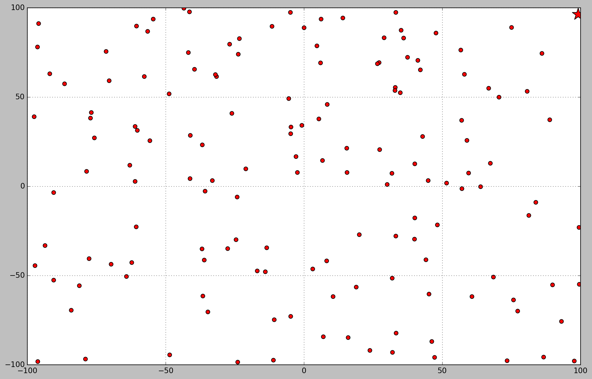


# Recompute distance matrix


```python
%time compute_distances()
data
```

    CPU times: user 365 ms, sys: 5.95 ms, total: 371 ms
    Wall time: 374 ms


<div>
<style scoped>
    .dataframe tbody tr th:only-of-type {
        vertical-align: middle;
    }

    .dataframe tbody tr th {
        vertical-align: top;
    }

    .dataframe thead th {
        text-align: right;
    }
</style>
<table border="1" class="dataframe">
  <thead>
    <tr style="text-align: right;">
      <th></th>
      <th>x</th>
      <th>y</th>
      <th>0</th>
      <th>1</th>
      <th>2</th>
      <th>3</th>
      <th>4</th>
      <th>5</th>
      <th>6</th>
      <th>7</th>
      <th>...</th>
      <th>140</th>
      <th>141</th>
      <th>142</th>
      <th>143</th>
      <th>144</th>
      <th>145</th>
      <th>146</th>
      <th>147</th>
      <th>148</th>
      <th>149</th>
    </tr>
  </thead>
  <tbody>
    <tr>
      <th>0</th>
      <td>99.076567</td>
      <td>96.487944</td>
      <td>0.000000</td>
      <td>117.736469</td>
      <td>161.814392</td>
      <td>54.573525</td>
      <td>65.865272</td>
      <td>241.298748</td>
      <td>76.842016</td>
      <td>199.190980</td>
      <td>...</td>
      <td>172.681309</td>
      <td>136.965856</td>
      <td>198.314834</td>
      <td>71.365094</td>
      <td>172.030897</td>
      <td>148.102471</td>
      <td>185.517910</td>
      <td>112.392284</td>
      <td>77.646716</td>
      <td>182.827181</td>
    </tr>
    <tr>
      <th>1</th>
      <td>30.074848</td>
      <td>1.090675</td>
      <td>117.736469</td>
      <td>0.000000</td>
      <td>79.199277</td>
      <td>63.440275</td>
      <td>96.539672</td>
      <td>123.683115</td>
      <td>68.434599</td>
      <td>98.436519</td>
      <td>...</td>
      <td>58.616164</td>
      <td>68.857475</td>
      <td>108.921496</td>
      <td>82.214930</td>
      <td>96.802687</td>
      <td>44.383034</td>
      <td>91.180819</td>
      <td>25.020186</td>
      <td>67.768880</td>
      <td>93.714821</td>
    </tr>
    <tr>
      <th>2</th>
      <td>75.720294</td>
      <td>-63.631955</td>
      <td>161.814392</td>
      <td>79.199277</td>
      <td>0.000000</td>
      <td>113.781493</td>
      <td>166.719068</td>
      <td>128.062552</td>
      <td>141.682044</td>
      <td>42.996311</td>
      <td>...</td>
      <td>57.276463</td>
      <td>145.932898</td>
      <td>170.304863</td>
      <td>154.196790</td>
      <td>167.877766</td>
      <td>38.886864</td>
      <td>152.116365</td>
      <td>104.218532</td>
      <td>141.236354</td>
      <td>157.968538</td>
    </tr>
    <tr>
      <th>3</th>
      <td>70.446614</td>
      <td>50.027257</td>
      <td>54.573525</td>
      <td>63.440275</td>
      <td>113.781493</td>
      <td>0.000000</td>
      <td>60.390171</td>
      <td>187.123389</td>
      <td>47.464297</td>
      <td>147.701132</td>
      <td>...</td>
      <td>118.299618</td>
      <td>96.980912</td>
      <td>154.751471</td>
      <td>53.194391</td>
      <td>132.536951</td>
      <td>94.792692</td>
      <td>139.732470</td>
      <td>62.001337</td>
      <td>47.732738</td>
      <td>138.795084</td>
    </tr>
    <tr>
      <th>4</th>
      <td>33.220333</td>
      <td>97.579090</td>
      <td>65.865272</td>
      <td>96.539672</td>
      <td>166.719068</td>
      <td>60.390171</td>
      <td>0.000000</td>
      <td>208.633848</td>
      <td>28.765741</td>
      <td>193.924735</td>
      <td>...</td>
      <td>154.693357</td>
      <td>82.044400</td>
      <td>143.027539</td>
      <td>14.908663</td>
      <td>113.910385</td>
      <td>139.028595</td>
      <td>133.655082</td>
      <td>78.229684</td>
      <td>29.574281</td>
      <td>128.838562</td>
    </tr>
    <tr>
      <th>5</th>
      <td>-48.606315</td>
      <td>-94.338815</td>
      <td>241.298748</td>
      <td>123.683115</td>
      <td>128.062552</td>
      <td>187.123389</td>
      <td>208.633848</td>
      <td>0.000000</td>
      <td>180.468687</td>
      <td>95.852974</td>
      <td>...</td>
      <td>77.408944</td>
      <td>137.103775</td>
      <td>107.028154</td>
      <td>193.825565</td>
      <td>128.622553</td>
      <td>106.925989</td>
      <td>98.008518</td>
      <td>132.278609</td>
      <td>179.587519</td>
      <td>107.224850</td>
    </tr>
    <tr>
      <th>6</th>
      <td>27.143823</td>
      <td>69.462477</td>
      <td>76.842016</td>
      <td>68.434599</td>
      <td>141.682044</td>
      <td>47.464297</td>
      <td>28.765741</td>
      <td>180.468687</td>
      <td>0.000000</td>
      <td>166.517540</td>
      <td>...</td>
      <td>126.181957</td>
      <td>60.422310</td>
      <td>122.108842</td>
      <td>13.951546</td>
      <td>95.203204</td>
      <td>111.777718</td>
      <td>110.540955</td>
      <td>49.469965</td>
      <td>0.916230</td>
      <td>106.958325</td>
    </tr>
    <tr>
      <th>7</th>
      <td>47.234925</td>
      <td>-95.838578</td>
      <td>199.190980</td>
      <td>98.436519</td>
      <td>42.996311</td>
      <td>147.701132</td>
      <td>193.924735</td>
      <td>95.852974</td>
      <td>166.517540</td>
      <td>0.000000</td>
      <td>...</td>
      <td>48.524090</td>
      <td>155.169851</td>
      <td>163.402757</td>
      <td>180.068054</td>
      <td>168.837654</td>
      <td>54.904573</td>
      <td>146.552646</td>
      <td>121.463982</td>
      <td>165.901224</td>
      <td>154.159518</td>
    </tr>
    <tr>
      <th>8</th>
      <td>-77.679374</td>
      <td>-40.455252</td>
      <td>223.598080</td>
      <td>115.486087</td>
      <td>155.140639</td>
      <td>173.575323</td>
      <td>177.065594</td>
      <td>61.226474</td>
      <td>151.887491</td>
      <td>136.641483</td>
      <td>...</td>
      <td>97.890812</td>
      <td>96.330687</td>
      <td>48.864310</td>
      <td>163.348464</td>
      <td>75.969024</td>
      <td>121.760819</td>
      <td>46.394717</td>
      <td>111.798720</td>
      <td>150.972491</td>
      <td>54.384039</td>
    </tr>
    <tr>
      <th>9</th>
      <td>37.394038</td>
      <td>72.325211</td>
      <td>66.246298</td>
      <td>71.609564</td>
      <td>141.255984</td>
      <td>39.870685</td>
      <td>25.596449</td>
      <td>187.544551</td>
      <td>10.642469</td>
      <td>168.451485</td>
      <td>...</td>
      <td>130.096654</td>
      <td>70.846519</td>
      <td>132.443410</td>
      <td>13.851032</td>
      <td>105.784607</td>
      <td>113.546950</td>
      <td>120.509879</td>
      <td>55.456475</td>
      <td>11.415928</td>
      <td>117.179733</td>
    </tr>
    <tr>
      <th>10</th>
      <td>-60.273128</td>
      <td>31.437806</td>
      <td>172.115792</td>
      <td>95.308474</td>
      <td>165.929113</td>
      <td>132.034914</td>
      <td>114.523783</td>
      <td>126.316558</td>
      <td>95.328899</td>
      <td>166.605100</td>
      <td>...</td>
      <td>118.287542</td>
      <td>35.456251</td>
      <td>29.438717</td>
      <td>103.192151</td>
      <td>2.380087</td>
      <td>127.044938</td>
      <td>28.577853</td>
      <td>76.389427</td>
      <td>94.504923</td>
      <td>19.715298</td>
    </tr>
    <tr>
      <th>11</th>
      <td>39.931126</td>
      <td>-29.521506</td>
      <td>139.199730</td>
      <td>32.159786</td>
      <td>49.440745</td>
      <td>85.200944</td>
      <td>127.277634</td>
      <td>109.727672</td>
      <td>99.806534</td>
      <td>66.718059</td>
      <td>...</td>
      <td>34.170205</td>
      <td>96.543753</td>
      <td>124.450615</td>
      <td>113.353321</td>
      <td>119.151104</td>
      <td>12.228572</td>
      <td>106.086252</td>
      <td>56.493675</td>
      <td>99.196287</td>
      <td>110.970068</td>
    </tr>
    <tr>
      <th>12</th>
      <td>57.992110</td>
      <td>62.809588</td>
      <td>53.124047</td>
      <td>67.739189</td>
      <td>127.678315</td>
      <td>17.846642</td>
      <td>42.691441</td>
      <td>189.891666</td>
      <td>31.557530</td>
      <td>159.012444</td>
      <td>...</td>
      <td>125.504070</td>
      <td>86.902225</td>
      <td>147.030837</td>
      <td>35.549018</td>
      <td>122.582092</td>
      <td>104.762143</td>
      <td>133.314565</td>
      <td>59.370370</td>
      <td>32.004987</td>
      <td>131.272965</td>
    </tr>
    <tr>
      <th>13</th>
      <td>-60.515743</td>
      <td>89.891059</td>
      <td>159.728596</td>
      <td>126.854891</td>
      <td>205.254899</td>
      <td>136.895075</td>
      <td>94.050826</td>
      <td>184.614411</td>
      <td>90.008480</td>
      <td>214.722389</td>
      <td>...</td>
      <td>166.498686</td>
      <td>59.863977</td>
      <td>83.473428</td>
      <td>89.699398</td>
      <td>56.216213</td>
      <td>167.568594</td>
      <td>87.021354</td>
      <td>102.289533</td>
      <td>89.588215</td>
      <td>78.017229</td>
    </tr>
    <tr>
      <th>14</th>
      <td>-4.679923</td>
      <td>33.320070</td>
      <td>121.472588</td>
      <td>47.398608</td>
      <td>125.951935</td>
      <td>76.961852</td>
      <td>74.603291</td>
      <td>135.004884</td>
      <td>48.156250</td>
      <td>139.201679</td>
      <td>...</td>
      <td>92.813901</td>
      <td>22.727764</td>
      <td>78.008534</td>
      <td>60.234037</td>
      <td>56.399249</td>
      <td>88.908315</td>
      <td>64.101842</td>
      <td>23.400342</td>
      <td>47.240087</td>
      <td>62.136653</td>
    </tr>
    <tr>
      <th>15</th>
      <td>-57.737593</td>
      <td>61.505265</td>
      <td>160.668816</td>
      <td>106.587745</td>
      <td>182.948985</td>
      <td>128.697068</td>
      <td>97.850218</td>
      <td>156.111362</td>
      <td>85.253574</td>
      <td>189.146277</td>
      <td>...</td>
      <td>140.662914</td>
      <td>37.749133</td>
      <td>57.056254</td>
      <td>89.376138</td>
      <td>28.027384</td>
      <td>144.496514</td>
      <td>58.729353</td>
      <td>83.461441</td>
      <td>84.596487</td>
      <td>49.871252</td>
    </tr>
    <tr>
      <th>16</th>
      <td>-36.062776</td>
      <td>-41.212805</td>
      <td>192.935581</td>
      <td>78.509679</td>
      <td>114.009092</td>
      <td>140.246209</td>
      <td>155.123626</td>
      <td>54.586750</td>
      <td>127.452314</td>
      <td>99.611656</td>
      <td>...</td>
      <td>57.031756</td>
      <td>82.720230</td>
      <td>65.352699</td>
      <td>140.457750</td>
      <td>78.957867</td>
      <td>80.143110</td>
      <td>50.692451</td>
      <td>81.076899</td>
      <td>126.552884</td>
      <td>59.571347</td>
    </tr>
    <tr>
      <th>17</th>
      <td>-39.616364</td>
      <td>65.577880</td>
      <td>142.095606</td>
      <td>94.949802</td>
      <td>173.198517</td>
      <td>111.156111</td>
      <td>79.556659</td>
      <td>160.169188</td>
      <td>66.873109</td>
      <td>183.298716</td>
      <td>...</td>
      <td>135.330717</td>
      <td>28.129780</td>
      <td>69.203161</td>
      <td>70.810371</td>
      <td>38.447726</td>
      <td>135.533075</td>
      <td>66.280727</td>
      <td>70.603715</td>
      <td>66.239800</td>
      <td>58.542554</td>
    </tr>
    <tr>
      <th>18</th>
      <td>10.506738</td>
      <td>-61.664519</td>
      <td>181.264492</td>
      <td>65.735267</td>
      <td>65.243228</td>
      <td>126.758990</td>
      <td>160.855321</td>
      <td>67.542303</td>
      <td>132.178220</td>
      <td>50.167978</td>
      <td>...</td>
      <td>9.877943</td>
      <td>108.908434</td>
      <td>113.354726</td>
      <td>146.129710</td>
      <td>119.224623</td>
      <td>39.410315</td>
      <td>96.388788</td>
      <td>83.205405</td>
      <td>131.414712</td>
      <td>104.013969</td>
    </tr>
    <tr>
      <th>19</th>
      <td>42.851348</td>
      <td>27.974071</td>
      <td>88.630841</td>
      <td>29.765012</td>
      <td>97.324363</td>
      <td>35.324803</td>
      <td>70.268165</td>
      <td>152.725068</td>
      <td>44.362306</td>
      <td>123.890225</td>
      <td>...</td>
      <td>87.756612</td>
      <td>70.157849</td>
      <td>123.019616</td>
      <td>57.045691</td>
      <td>104.085773</td>
      <td>69.009729</td>
      <td>106.928212</td>
      <td>28.177386</td>
      <td>43.931320</td>
      <td>107.075533</td>
    </tr>
    <tr>
      <th>20</th>
      <td>6.640766</td>
      <td>14.505583</td>
      <td>123.553571</td>
      <td>27.002147</td>
      <td>104.295043</td>
      <td>73.027225</td>
      <td>87.222021</td>
      <td>122.062865</td>
      <td>58.656932</td>
      <td>117.574315</td>
      <td>...</td>
      <td>72.005774</td>
      <td>42.062065</td>
      <td>85.460217</td>
      <td>72.316444</td>
      <td>70.380430</td>
      <td>66.972524</td>
      <td>68.721275</td>
      <td>11.184979</td>
      <td>57.798040</td>
      <td>69.701862</td>
    </tr>
    <tr>
      <th>21</th>
      <td>-97.533493</td>
      <td>39.047596</td>
      <td>204.828975</td>
      <td>133.133829</td>
      <td>201.395046</td>
      <td>168.338555</td>
      <td>143.256758</td>
      <td>142.076751</td>
      <td>128.333542</td>
      <td>197.869084</td>
      <td>...</td>
      <td>150.583972</td>
      <td>71.453269</td>
      <td>36.023443</td>
      <td>133.992086</td>
      <td>36.848832</td>
      <td>162.683708</td>
      <td>51.351098</td>
      <td>114.357458</td>
      <td>127.589765</td>
      <td>43.908023</td>
    </tr>
    <tr>
      <th>22</th>
      <td>6.931842</td>
      <td>-84.173057</td>
      <td>202.802977</td>
      <td>88.348756</td>
      <td>71.789888</td>
      <td>148.471716</td>
      <td>183.643479</td>
      <td>56.460868</td>
      <td>154.959354</td>
      <td>41.957394</td>
      <td>...</td>
      <td>30.194834</td>
      <td>129.368139</td>
      <td>126.038572</td>
      <td>168.910884</td>
      <td>136.066655</td>
      <td>56.936572</td>
      <td>110.469669</td>
      <td>105.910143</td>
      <td>154.193375</td>
      <td>118.848436</td>
    </tr>
    <tr>
      <th>23</th>
      <td>-97.272500</td>
      <td>-44.429392</td>
      <td>241.682957</td>
      <td>135.238395</td>
      <td>174.055293</td>
      <td>192.488336</td>
      <td>192.859504</td>
      <td>69.709024</td>
      <td>168.673588</td>
      <td>153.379595</td>
      <td>...</td>
      <td>116.788665</td>
      <td>111.117040</td>
      <td>56.032174</td>
      <td>179.566372</td>
      <td>86.085715</td>
      <td>141.393610</td>
      <td>59.553834</td>
      <td>130.536369</td>
      <td>167.763931</td>
      <td>65.941462</td>
    </tr>
    <tr>
      <th>24</th>
      <td>99.477056</td>
      <td>-54.879872</td>
      <td>151.368346</td>
      <td>89.159232</td>
      <td>25.317636</td>
      <td>108.849770</td>
      <td>166.233837</td>
      <td>153.250426</td>
      <td>143.851022</td>
      <td>66.384153</td>
      <td>...</td>
      <td>80.596406</td>
      <td>157.941751</td>
      <td>188.987345</td>
      <td>155.139934</td>
      <td>183.358596</td>
      <td>57.103298</td>
      <td>170.635735</td>
      <td>113.479903</td>
      <td>143.553342</td>
      <td>175.682608</td>
    </tr>
    <tr>
      <th>25</th>
      <td>-78.996929</td>
      <td>-96.739844</td>
      <td>262.768240</td>
      <td>146.517791</td>
      <td>158.219947</td>
      <td>209.461105</td>
      <td>224.393766</td>
      <td>30.485314</td>
      <td>197.203121</td>
      <td>126.235072</td>
      <td>...</td>
      <td>105.859884</td>
      <td>147.458288</td>
      <td>105.140954</td>
      <td>209.914619</td>
      <td>131.642742</td>
      <td>135.100458</td>
      <td>101.208433</td>
      <td>151.249294</td>
      <td>196.296113</td>
      <td>109.823061</td>
    </tr>
    <tr>
      <th>26</th>
      <td>-31.674510</td>
      <td>61.639612</td>
      <td>135.315373</td>
      <td>86.482119</td>
      <td>165.004877</td>
      <td>102.779232</td>
      <td>74.182119</td>
      <td>156.894728</td>
      <td>59.336275</td>
      <td>176.142212</td>
      <td>...</td>
      <td>128.461820</td>
      <td>21.468972</td>
      <td>70.968457</td>
      <td>64.368608</td>
      <td>40.576327</td>
      <td>127.588116</td>
      <td>65.718093</td>
      <td>61.973721</td>
      <td>58.655820</td>
      <td>58.777123</td>
    </tr>
    <tr>
      <th>27</th>
      <td>-56.536075</td>
      <td>86.920994</td>
      <td>155.906450</td>
      <td>121.935621</td>
      <td>200.394455</td>
      <td>132.233699</td>
      <td>90.386990</td>
      <td>181.433181</td>
      <td>85.481724</td>
      <td>210.165367</td>
      <td>...</td>
      <td>162.003470</td>
      <td>55.167786</td>
      <td>81.561966</td>
      <td>85.553841</td>
      <td>53.436712</td>
      <td>162.768923</td>
      <td>84.172605</td>
      <td>97.346099</td>
      <td>85.042773</td>
      <td>75.286305</td>
    </tr>
    <tr>
      <th>28</th>
      <td>97.699575</td>
      <td>-97.796661</td>
      <td>194.289484</td>
      <td>119.799035</td>
      <td>40.624081</td>
      <td>150.315118</td>
      <td>205.740751</td>
      <td>146.346747</td>
      <td>181.531632</td>
      <td>50.502624</td>
      <td>...</td>
      <td>88.992079</td>
      <td>185.918792</td>
      <td>205.814807</td>
      <td>193.708387</td>
      <td>206.145160</td>
      <td>78.090334</td>
      <td>188.010037</td>
      <td>144.813096</td>
      <td>181.125415</td>
      <td>194.589012</td>
    </tr>
    <tr>
      <th>29</th>
      <td>56.980551</td>
      <td>37.072724</td>
      <td>72.816502</td>
      <td>44.929107</td>
      <td>102.433443</td>
      <td>18.685684</td>
      <td>65.004371</td>
      <td>168.575143</td>
      <td>44.037785</td>
      <td>133.268118</td>
      <td>...</td>
      <td>100.979544</td>
      <td>83.173313</td>
      <td>138.580254</td>
      <td>54.064519</td>
      <td>118.107395</td>
      <td>79.155743</td>
      <td>122.922888</td>
      <td>44.388740</td>
      <td>43.940802</td>
      <td>122.602601</td>
    </tr>
    <tr>
      <th>...</th>
      <td>...</td>
      <td>...</td>
      <td>...</td>
      <td>...</td>
      <td>...</td>
      <td>...</td>
      <td>...</td>
      <td>...</td>
      <td>...</td>
      <td>...</td>
      <td>...</td>
      <td>...</td>
      <td>...</td>
      <td>...</td>
      <td>...</td>
      <td>...</td>
      <td>...</td>
      <td>...</td>
      <td>...</td>
      <td>...</td>
      <td>...</td>
    </tr>
    <tr>
      <th>120</th>
      <td>89.841848</td>
      <td>-55.198411</td>
      <td>151.967201</td>
      <td>82.100886</td>
      <td>16.448190</td>
      <td>106.998208</td>
      <td>162.932381</td>
      <td>143.874477</td>
      <td>139.539885</td>
      <td>58.881007</td>
      <td>...</td>
      <td>70.956942</td>
      <td>150.597316</td>
      <td>180.049519</td>
      <td>151.294774</td>
      <td>175.144991</td>
      <td>47.906471</td>
      <td>161.716165</td>
      <td>106.770982</td>
      <td>139.190062</td>
      <td>166.938975</td>
    </tr>
    <tr>
      <th>121</th>
      <td>15.997366</td>
      <td>-84.731802</td>
      <td>199.355838</td>
      <td>86.969380</td>
      <td>63.340601</td>
      <td>145.343471</td>
      <td>183.122614</td>
      <td>65.314090</td>
      <td>154.596635</td>
      <td>33.153364</td>
      <td>...</td>
      <td>28.430318</td>
      <td>132.504217</td>
      <td>132.749649</td>
      <td>168.527388</td>
      <td>141.284883</td>
      <td>51.951419</td>
      <td>116.690174</td>
      <td>106.126929</td>
      <td>153.861518</td>
      <td>124.831864</td>
    </tr>
    <tr>
      <th>122</th>
      <td>57.065474</td>
      <td>-1.286114</td>
      <td>106.417566</td>
      <td>27.095074</td>
      <td>65.076925</td>
      <td>53.029397</td>
      <td>101.700144</td>
      <td>140.802458</td>
      <td>76.815809</td>
      <td>95.062127</td>
      <td>...</td>
      <td>67.081494</td>
      <td>93.259771</td>
      <td>136.011933</td>
      <td>89.137095</td>
      <td>123.208583</td>
      <td>41.806413</td>
      <td>118.227181</td>
      <td>47.391617</td>
      <td>76.412903</td>
      <td>120.801706</td>
    </tr>
    <tr>
      <th>123</th>
      <td>8.397404</td>
      <td>45.994062</td>
      <td>103.789897</td>
      <td>49.862068</td>
      <td>128.647717</td>
      <td>62.180150</td>
      <td>57.246772</td>
      <td>151.468612</td>
      <td>30.036557</td>
      <td>147.053904</td>
      <td>...</td>
      <td>102.980237</td>
      <td>34.874979</td>
      <td>94.773546</td>
      <td>42.586471</td>
      <td>70.558705</td>
      <td>94.050645</td>
      <td>81.779271</td>
      <td>25.592168</td>
      <td>29.120939</td>
      <td>79.125814</td>
    </tr>
    <tr>
      <th>124</th>
      <td>-95.971359</td>
      <td>91.328450</td>
      <td>195.116154</td>
      <td>155.017749</td>
      <td>231.280675</td>
      <td>171.466411</td>
      <td>129.342815</td>
      <td>191.613623</td>
      <td>125.041868</td>
      <td>235.668275</td>
      <td>...</td>
      <td>187.170662</td>
      <td>86.161684</td>
      <td>84.727760</td>
      <td>125.170250</td>
      <td>67.388112</td>
      <td>192.696071</td>
      <td>95.086406</td>
      <td>131.553313</td>
      <td>124.577837</td>
      <td>85.982245</td>
    </tr>
    <tr>
      <th>125</th>
      <td>33.324722</td>
      <td>-82.136313</td>
      <td>190.341615</td>
      <td>83.290415</td>
      <td>46.257927</td>
      <td>137.277982</td>
      <td>179.715433</td>
      <td>82.834751</td>
      <td>151.724741</td>
      <td>19.525516</td>
      <td>...</td>
      <td>29.461763</td>
      <td>136.642539</td>
      <td>143.959295</td>
      <td>165.492170</td>
      <td>149.414715</td>
      <td>42.495197</td>
      <td>127.044144</td>
      <td>105.061245</td>
      <td>151.056109</td>
      <td>134.634173</td>
    </tr>
    <tr>
      <th>126</th>
      <td>34.783261</td>
      <td>52.531436</td>
      <td>77.883271</td>
      <td>51.655794</td>
      <td>123.165636</td>
      <td>35.751163</td>
      <td>45.074759</td>
      <td>168.892546</td>
      <td>18.574746</td>
      <td>148.891587</td>
      <td>...</td>
      <td>110.133009</td>
      <td>61.987590</td>
      <td>121.669896</td>
      <td>31.316133</td>
      <td>97.697766</td>
      <td>94.016941</td>
      <td>107.969947</td>
      <td>36.649855</td>
      <td>18.205969</td>
      <td>105.895608</td>
    </tr>
    <tr>
      <th>127</th>
      <td>45.139227</td>
      <td>-60.250218</td>
      <td>165.759126</td>
      <td>63.163602</td>
      <td>30.767480</td>
      <td>113.144091</td>
      <td>158.278711</td>
      <td>99.750986</td>
      <td>130.955022</td>
      <td>35.650012</td>
      <td>...</td>
      <td>26.517063</td>
      <td>123.726290</td>
      <td>141.508196</td>
      <td>144.459031</td>
      <td>141.790525</td>
      <td>19.254651</td>
      <td>123.566617</td>
      <td>86.873475</td>
      <td>130.350663</td>
      <td>130.017410</td>
    </tr>
    <tr>
      <th>128</th>
      <td>35.987597</td>
      <td>83.219655</td>
      <td>64.469107</td>
      <td>82.341544</td>
      <td>152.131793</td>
      <td>47.845157</td>
      <td>14.623649</td>
      <td>196.680299</td>
      <td>16.354579</td>
      <td>179.411128</td>
      <td>...</td>
      <td>140.711171</td>
      <td>75.139046</td>
      <td>136.852089</td>
      <td>7.047020</td>
      <td>108.977736</td>
      <td>124.507642</td>
      <td>126.014265</td>
      <td>65.146838</td>
      <td>17.262478</td>
      <td>122.006644</td>
    </tr>
    <tr>
      <th>129</th>
      <td>67.314264</td>
      <td>13.003851</td>
      <td>89.322100</td>
      <td>39.098566</td>
      <td>77.095448</td>
      <td>37.155675</td>
      <td>91.188634</td>
      <td>157.987432</td>
      <td>69.290986</td>
      <td>110.679059</td>
      <td>...</td>
      <td>84.664752</td>
      <td>97.496483</td>
      <td>145.987959</td>
      <td>80.085853</td>
      <td>130.046105</td>
      <td>58.812516</td>
      <td>128.801988</td>
      <td>52.535424</td>
      <td>69.076799</td>
      <td>130.331715</td>
    </tr>
    <tr>
      <th>130</th>
      <td>-36.886862</td>
      <td>-35.034144</td>
      <td>189.166893</td>
      <td>76.084644</td>
      <td>116.181782</td>
      <td>136.952243</td>
      <td>150.004295</td>
      <td>60.451548</td>
      <td>122.553957</td>
      <td>103.796215</td>
      <td>...</td>
      <td>59.752355</td>
      <td>76.701618</td>
      <td>60.221539</td>
      <td>135.409580</td>
      <td>72.845897</td>
      <td>81.188287</td>
      <td>44.972966</td>
      <td>76.964773</td>
      <td>121.649555</td>
      <td>53.727826</td>
    </tr>
    <tr>
      <th>131</th>
      <td>42.068799</td>
      <td>65.334579</td>
      <td>64.964742</td>
      <td>65.353914</td>
      <td>133.284620</td>
      <td>32.243053</td>
      <td>33.436564</td>
      <td>183.623444</td>
      <td>15.485298</td>
      <td>161.255931</td>
      <td>...</td>
      <td>123.969250</td>
      <td>72.417874</td>
      <td>133.426864</td>
      <td>22.248948</td>
      <td>107.895462</td>
      <td>106.378312</td>
      <td>120.594648</td>
      <td>51.373083</td>
      <td>15.897325</td>
      <td>117.881047</td>
    </tr>
    <tr>
      <th>132</th>
      <td>-69.769883</td>
      <td>-43.590844</td>
      <td>219.388219</td>
      <td>109.386510</td>
      <td>146.864011</td>
      <td>168.597197</td>
      <td>174.745343</td>
      <td>54.984118</td>
      <td>148.907085</td>
      <td>128.140356</td>
      <td>...</td>
      <td>89.593395</td>
      <td>95.112353</td>
      <td>52.735908</td>
      <td>160.762448</td>
      <td>77.755833</td>
      <td>113.878913</td>
      <td>47.266508</td>
      <td>107.172530</td>
      <td>147.990855</td>
      <td>55.914424</td>
    </tr>
    <tr>
      <th>133</th>
      <td>33.143474</td>
      <td>-27.783041</td>
      <td>140.678536</td>
      <td>29.036321</td>
      <td>55.659054</td>
      <td>86.290015</td>
      <td>125.362154</td>
      <td>105.416788</td>
      <td>97.430420</td>
      <td>69.499101</td>
      <td>...</td>
      <td>32.011960</td>
      <td>90.710902</td>
      <td>117.456747</td>
      <td>111.160293</td>
      <td>112.494937</td>
      <td>17.174169</td>
      <td>99.092814</td>
      <td>52.261883</td>
      <td>96.775793</td>
      <td>104.028296</td>
    </tr>
    <tr>
      <th>134</th>
      <td>-41.797934</td>
      <td>75.064175</td>
      <td>142.494221</td>
      <td>103.139593</td>
      <td>181.788752</td>
      <td>115.002981</td>
      <td>78.324082</td>
      <td>169.539751</td>
      <td>69.168959</td>
      <td>192.703401</td>
      <td>...</td>
      <td>144.843457</td>
      <td>37.590972</td>
      <td>76.148121</td>
      <td>71.216505</td>
      <td>45.657050</td>
      <td>144.401073</td>
      <td>74.725486</td>
      <td>78.474180</td>
      <td>68.633958</td>
      <td>66.618645</td>
    </tr>
    <tr>
      <th>135</th>
      <td>5.324715</td>
      <td>37.861594</td>
      <td>110.573318</td>
      <td>44.324593</td>
      <td>123.517116</td>
      <td>66.248509</td>
      <td>65.911644</td>
      <td>142.777814</td>
      <td>38.401684</td>
      <td>140.114958</td>
      <td>...</td>
      <td>95.282659</td>
      <td>31.576193</td>
      <td>88.946645</td>
      <td>51.207196</td>
      <td>66.534434</td>
      <td>87.892156</td>
      <td>75.066808</td>
      <td>19.333251</td>
      <td>37.490693</td>
      <td>73.097992</td>
    </tr>
    <tr>
      <th>136</th>
      <td>68.512768</td>
      <td>-50.739106</td>
      <td>150.366053</td>
      <td>64.527513</td>
      <td>14.770714</td>
      <td>100.784918</td>
      <td>152.459316</td>
      <td>124.971254</td>
      <td>127.121243</td>
      <td>49.866912</td>
      <td>...</td>
      <td>49.944368</td>
      <td>131.723944</td>
      <td>158.555876</td>
      <td>139.756261</td>
      <td>154.660813</td>
      <td>26.293040</td>
      <td>140.251971</td>
      <td>89.545938</td>
      <td>126.661060</td>
      <td>145.685918</td>
    </tr>
    <tr>
      <th>137</th>
      <td>-64.144841</td>
      <td>-50.464696</td>
      <td>219.627654</td>
      <td>107.402542</td>
      <td>140.483568</td>
      <td>167.968724</td>
      <td>177.191816</td>
      <td>46.544432</td>
      <td>150.718768</td>
      <td>120.267375</td>
      <td>...</td>
      <td>83.256175</td>
      <td>98.972952</td>
      <td>60.614178</td>
      <td>162.964343</td>
      <td>84.198224</td>
      <td>108.635878</td>
      <td>53.423778</td>
      <td>107.235560</td>
      <td>149.804162</td>
      <td>62.388769</td>
    </tr>
    <tr>
      <th>138</th>
      <td>-26.845766</td>
      <td>79.781956</td>
      <td>127.025683</td>
      <td>97.119896</td>
      <td>176.316042</td>
      <td>101.740598</td>
      <td>62.647221</td>
      <td>175.475253</td>
      <td>54.966966</td>
      <td>190.605668</td>
      <td>...</td>
      <td>143.705771</td>
      <td>38.883215</td>
      <td>88.169982</td>
      <td>55.897455</td>
      <td>57.423469</td>
      <td>140.088304</td>
      <td>84.188922</td>
      <td>72.099782</td>
      <td>54.516591</td>
      <td>76.903493</td>
    </tr>
    <tr>
      <th>139</th>
      <td>0.068680</td>
      <td>88.957681</td>
      <td>99.293840</td>
      <td>92.849238</td>
      <td>170.313722</td>
      <td>80.427803</td>
      <td>34.254355</td>
      <td>189.649310</td>
      <td>33.363548</td>
      <td>190.720508</td>
      <td>...</td>
      <td>146.621116</td>
      <td>54.717565</td>
      <td>112.598467</td>
      <td>29.421860</td>
      <td>82.430589</td>
      <td>137.231302</td>
      <td>105.598414</td>
      <td>69.293345</td>
      <td>33.297406</td>
      <td>99.574313</td>
    </tr>
    <tr>
      <th>140</th>
      <td>18.895939</td>
      <td>-56.449630</td>
      <td>172.681309</td>
      <td>58.616164</td>
      <td>57.276463</td>
      <td>118.299618</td>
      <td>154.693357</td>
      <td>77.408944</td>
      <td>126.181957</td>
      <td>48.524090</td>
      <td>...</td>
      <td>0.000000</td>
      <td>107.252558</td>
      <td>117.094805</td>
      <td>140.107971</td>
      <td>120.493838</td>
      <td>29.532534</td>
      <td>99.581774</td>
      <td>77.919459</td>
      <td>125.450782</td>
      <td>106.689342</td>
    </tr>
    <tr>
      <th>141</th>
      <td>-26.104390</td>
      <td>40.905810</td>
      <td>136.965856</td>
      <td>68.857475</td>
      <td>145.932898</td>
      <td>96.980912</td>
      <td>82.044400</td>
      <td>137.103775</td>
      <td>60.422310</td>
      <td>155.169851</td>
      <td>...</td>
      <td>107.252558</td>
      <td>0.000000</td>
      <td>61.745510</td>
      <td>69.477160</td>
      <td>35.712774</td>
      <td>107.881768</td>
      <td>51.676834</td>
      <td>45.910194</td>
      <td>59.568512</td>
      <td>46.933719</td>
    </tr>
    <tr>
      <th>142</th>
      <td>-78.601095</td>
      <td>8.400365</td>
      <td>198.314834</td>
      <td>108.921496</td>
      <td>170.304863</td>
      <td>154.751471</td>
      <td>143.027539</td>
      <td>107.028154</td>
      <td>122.108842</td>
      <td>163.402757</td>
      <td>...</td>
      <td>117.094805</td>
      <td>61.745510</td>
      <td>0.000000</td>
      <td>131.053150</td>
      <td>30.757098</td>
      <td>132.263062</td>
      <td>18.364522</td>
      <td>94.947451</td>
      <td>121.244564</td>
      <td>15.979246</td>
    </tr>
    <tr>
      <th>143</th>
      <td>28.941010</td>
      <td>83.297786</td>
      <td>71.365094</td>
      <td>82.214930</td>
      <td>154.196790</td>
      <td>53.194391</td>
      <td>14.908663</td>
      <td>193.825565</td>
      <td>13.951546</td>
      <td>180.068054</td>
      <td>...</td>
      <td>140.107971</td>
      <td>69.477160</td>
      <td>131.053150</td>
      <td>0.000000</td>
      <td>102.789037</td>
      <td>125.240877</td>
      <td>120.721578</td>
      <td>63.356419</td>
      <td>14.726106</td>
      <td>116.409592</td>
    </tr>
    <tr>
      <th>144</th>
      <td>-61.078038</td>
      <td>33.677658</td>
      <td>172.030897</td>
      <td>96.802687</td>
      <td>167.877766</td>
      <td>132.536951</td>
      <td>113.910385</td>
      <td>128.622553</td>
      <td>95.203204</td>
      <td>168.837654</td>
      <td>...</td>
      <td>120.493838</td>
      <td>35.712774</td>
      <td>30.757098</td>
      <td>102.789037</td>
      <td>0.000000</td>
      <td>128.991014</td>
      <td>30.806070</td>
      <td>77.510705</td>
      <td>94.389526</td>
      <td>21.849691</td>
    </tr>
    <tr>
      <th>145</th>
      <td>44.080113</td>
      <td>-41.024718</td>
      <td>148.102471</td>
      <td>44.383034</td>
      <td>38.886864</td>
      <td>94.792692</td>
      <td>139.028595</td>
      <td>106.925989</td>
      <td>111.777718</td>
      <td>54.904573</td>
      <td>...</td>
      <td>29.532534</td>
      <td>107.881768</td>
      <td>132.263062</td>
      <td>125.240877</td>
      <td>128.991014</td>
      <td>0.000000</td>
      <td>113.962007</td>
      <td>68.670000</td>
      <td>111.183576</td>
      <td>119.462961</td>
    </tr>
    <tr>
      <th>146</th>
      <td>-61.088577</td>
      <td>2.871590</td>
      <td>185.517910</td>
      <td>91.180819</td>
      <td>152.116365</td>
      <td>139.732470</td>
      <td>133.655082</td>
      <td>98.008518</td>
      <td>110.540955</td>
      <td>146.552646</td>
      <td>...</td>
      <td>99.581774</td>
      <td>51.676834</td>
      <td>18.364522</td>
      <td>120.721578</td>
      <td>30.806070</td>
      <td>113.962007</td>
      <td>0.000000</td>
      <td>78.750857</td>
      <td>109.645851</td>
      <td>9.244708</td>
    </tr>
    <tr>
      <th>147</th>
      <td>15.453097</td>
      <td>21.393731</td>
      <td>112.392284</td>
      <td>25.020186</td>
      <td>104.218532</td>
      <td>62.001337</td>
      <td>78.229684</td>
      <td>132.278609</td>
      <td>49.469965</td>
      <td>121.463982</td>
      <td>...</td>
      <td>77.919459</td>
      <td>45.910194</td>
      <td>94.947451</td>
      <td>63.356419</td>
      <td>77.510705</td>
      <td>68.670000</td>
      <td>78.750857</td>
      <td>0.000000</td>
      <td>48.655456</td>
      <td>79.036577</td>
    </tr>
    <tr>
      <th>148</th>
      <td>26.546590</td>
      <td>68.767646</td>
      <td>77.646716</td>
      <td>67.768880</td>
      <td>141.236354</td>
      <td>47.732738</td>
      <td>29.574281</td>
      <td>179.587519</td>
      <td>0.916230</td>
      <td>165.901224</td>
      <td>...</td>
      <td>125.450782</td>
      <td>59.568512</td>
      <td>121.244564</td>
      <td>14.726106</td>
      <td>94.389526</td>
      <td>111.183576</td>
      <td>109.645851</td>
      <td>48.655456</td>
      <td>0.000000</td>
      <td>106.081385</td>
    </tr>
    <tr>
      <th>149</th>
      <td>-63.012893</td>
      <td>11.913804</td>
      <td>182.827181</td>
      <td>93.714821</td>
      <td>157.968538</td>
      <td>138.795084</td>
      <td>128.838562</td>
      <td>107.224850</td>
      <td>106.958325</td>
      <td>154.159518</td>
      <td>...</td>
      <td>106.689342</td>
      <td>46.933719</td>
      <td>15.979246</td>
      <td>116.409592</td>
      <td>21.849691</td>
      <td>119.462961</td>
      <td>9.244708</td>
      <td>79.036577</td>
      <td>106.081385</td>
      <td>0.000000</td>
    </tr>
  </tbody>
</table>
<p>150 rows × 152 columns</p>
</div>


# Scenario: farthest depot, one van, nearest neighbor heuristic

## Apply a greedy NN algorithm


```python
%time route = nearest_neighbor(list(range(size+1)))
print('cost={}\nroute={}'.format(estimate_cost(route),route))
```

    CPU times: user 111 ms, sys: 13.4 ms, total: 124 ms
    Wall time: 118 ms
    cost=2598.9001149206997
    route=[0, 84, 77, 83, 3, 49, 12, 73, 104, 128, 89, 143, 9, 85, 131, 31, 70, 126, 148, 6, 71, 41, 139, 76, 101, 32, 99, 96, 138, 87, 78, 26, 17, 134, 27, 13, 109, 88, 59, 118, 40, 15, 56, 144, 10, 105, 82, 93, 114, 86, 97, 44, 64, 53, 60, 20, 66, 147, 55, 51, 1, 119, 103, 122, 74, 92, 129, 42, 29, 19, 90, 106, 81, 11, 133, 116, 57, 30, 34, 67, 75, 46, 39, 130, 16, 113, 72, 95, 38, 22, 121, 91, 36, 125, 112, 7, 58, 110, 28, 107, 63, 2, 136, 50, 127, 69, 140, 18, 145, 37, 54, 94, 24, 120, 35, 123, 135, 33, 14, 52, 65, 141, 149, 146, 142, 108, 111, 23, 47, 100, 45, 137, 98, 132, 8, 48, 62, 80, 102, 43, 68, 61, 124, 21, 25, 117, 5, 79, 115, 4, 0]


## Plot result path


```python
coords=get_coords(route)
plt.plot(coords[0], coords[1], 'b-', linewidth=2)
plt.scatter(data.x, data.y, c='r', s=30)
plt.scatter(data.iloc[0].x, data.iloc[0].y, marker='*', c='r', s=400)
plt.axis([-100,100,-100,100])
plt.grid(True)
```


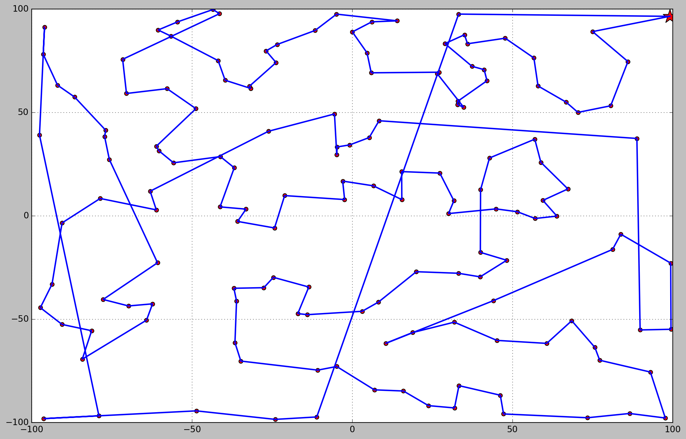


## Let's improve it with a 2-opt heuristic


```python
%time twoOpt(route)
```

    exchanging 84-4,77-0 with 84-77,4-0 => save=15.967192548480725 => cost: 2582.932922372219
    ...
    exchanging 3-49,12-83 with 3-12,49-83 => save=1.0654890882007315 => cost: 2111.9918767877866
    CPU times: user 3min 36s, sys: 1.67 s, total: 3min 38s
    Wall time: 3min 44s


## Plot improved path


```python
coords=get_coords(route)
plt.plot(coords[0], coords[1], 'b-', linewidth=2)
plt.scatter(data.x, data.y, c='r', s=30)
plt.scatter(data.iloc[0].x, data.iloc[0].y, marker='*', c='r', s=400)
plt.axis([-100,100,-100,100])
plt.grid(True)
```


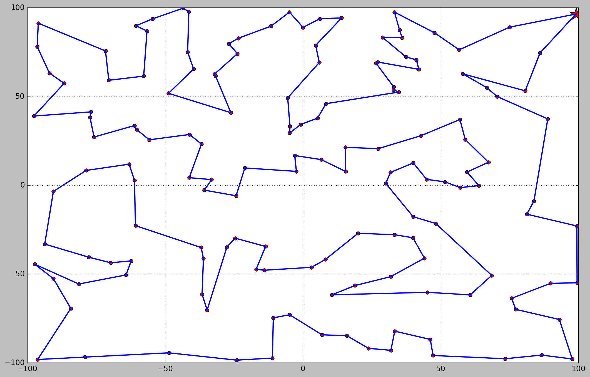


## A great optimized route too.

# Scenario: farthest depot, one van, 2-opt heuristic

## Just for fun, let's pass a random route to 2-opt heuristic


```python
route = [x for x in range(size+1)]+[0]
print('cost={}\nroute={}'.format(estimate_cost(route),route))
```

    cost=16502.514122712284
    route=[0, 1, 2, 3, 4, 5, 6, 7, 8, 9, 10, 11, 12, 13, 14, 15, 16, 17, 18, 19, 20, 21, 22, 23, 24, 25, 26, 27, 28, 29, 30, 31, 32, 33, 34, 35, 36, 37, 38, 39, 40, 41, 42, 43, 44, 45, 46, 47, 48, 49, 50, 51, 52, 53, 54, 55, 56, 57, 58, 59, 60, 61, 62, 63, 64, 65, 66, 67, 68, 69, 70, 71, 72, 73, 74, 75, 76, 77, 78, 79, 80, 81, 82, 83, 84, 85, 86, 87, 88, 89, 90, 91, 92, 93, 94, 95, 96, 97, 98, 99, 100, 101, 102, 103, 104, 105, 106, 107, 108, 109, 110, 111, 112, 113, 114, 115, 116, 117, 118, 119, 120, 121, 122, 123, 124, 125, 126, 127, 128, 129, 130, 131, 132, 133, 134, 135, 136, 137, 138, 139, 140, 141, 142, 143, 144, 145, 146, 147, 148, 149, 0]


## Plot result path


```python
coords=get_coords(route)
plt.plot(coords[0], coords[1], 'b-', linewidth=2)
plt.scatter(data.x, data.y, c='r', s=30)
plt.scatter(data.iloc[0].x, data.iloc[0].y, marker='*', c='r', s=400)
plt.axis([-100,100,-100,100])
plt.grid(True)
```


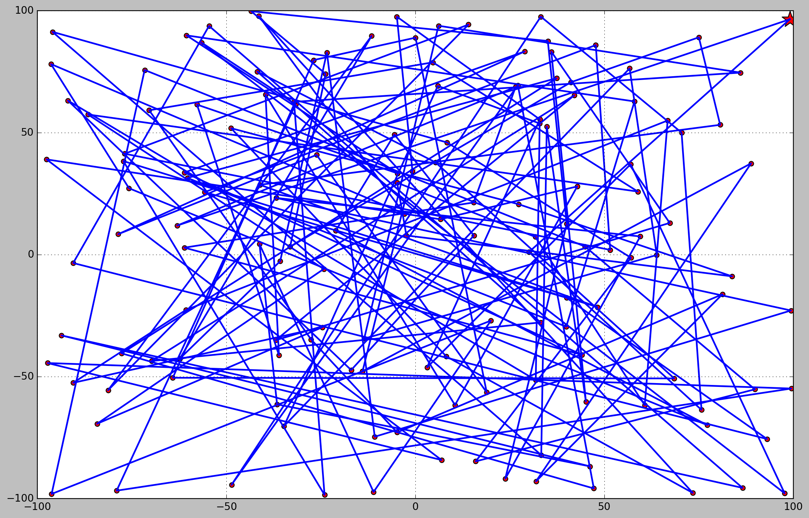


## Let's see what 2-opt heuristic can do


```python
%time twoOpt(route)
```

    exchanging 0-2,1-3 with 0-1,2-3 => save=6.263294946633721 => cost: 16496.25082776565
    ...
    exchanging 31-70,126-131 with 31-126,70-131 => save=1.7915970025161734 => cost: 2147.6785119636334
    CPU times: user 30min 1s, sys: 27.7 s, total: 30min 29s
    Wall time: 33min 24s


## Plot improved path


```python
coords=get_coords(route)
plt.plot(coords[0], coords[1], 'b-', linewidth=2)
plt.scatter(data.x, data.y, c='r', s=30)
plt.scatter(data.iloc[0].x, data.iloc[0].y, marker='*', c='r', s=400)
plt.axis([-100,100,-100,100])
plt.grid(True)
```


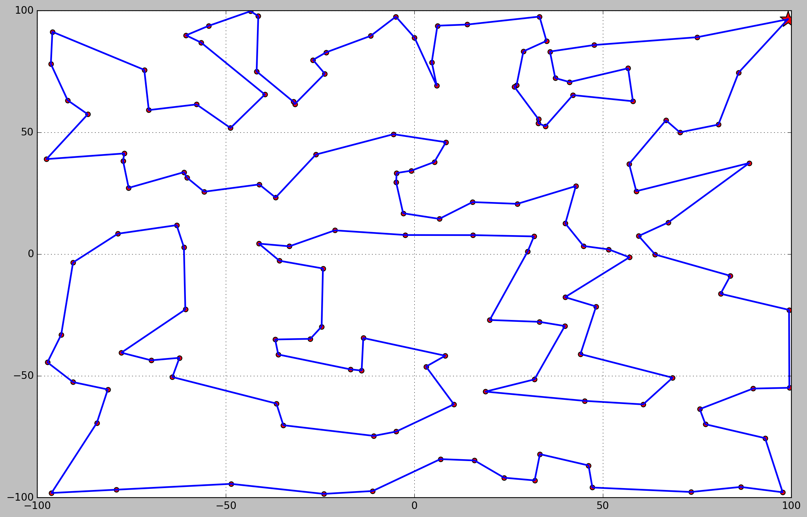


## Yes, it's beautiful what this heuristic can do.

## Only again extremely slower. It's best suited to improve a path, not to build one.

# Scenario: farthest depot, several vans, no clustering

## Let's apply a sequential NN algorithm, but including a max cost constraint


```python
%time result_paths = sequential_nn(400)
```

    van 1: 385.64822798111754
    van 2: 396.65132151762236
    van 3: 356.93203827425646
    van 4: 396.0161561312648
    van 5: 387.061496278307
    van 6: 395.6147269472501
    van 7: 369.199156243418
    van 8: 394.6734767469922
    van 9: 397.84112119751114
    van 10: 398.459895479128
    van 11: 398.88707002367426
    van 12: 393.1275886242274
    van 13: 399.0252974546198
    van 14: 369.5354695202354
    van 15: 399.04095929693733
    van 16: 398.1246462968952
    van 17: 390.2323088432243
    van 18: 391.6922432861831
    van 19: 396.62966713208937
    van 20: 397.37088575736055
    van 21: 398.69882895151926
    van 22: 398.71167524672734
    van 23: 401.9265755043099
    van 24: 405.5614801848182
    van 25: 405.6059533951813
    van 26: 406.6405588064364
    van 27: 409.6579507334966
    van 28: 416.22815658152126
    van 29: 426.0013563494297
    van 30: 427.5654816187484
    van 31: 428.5781354316992
    van 32: 438.7764370279704
    van 33: 439.2553078706148
    van 34: 445.7400163235422
    van 35: 447.1961602342642
    van 36: 461.09599384348525
    van 37: 464.4374453992292
    van 38: 471.7901899743616
    van 39: 482.2725996546565
    van 40: 482.59749534967307
    van 41: 483.3659132930797
    van 42: 494.26350457825447
    van 43: 525.5364809069648
    van 44: 551.3280289580272
    CPU times: user 1.22 s, sys: 48.8 ms, total: 1.27 s
    Wall time: 1.43 s


## Plot result paths


```python
for path in result_paths:
    coords=get_coords(path)
    plt.plot(coords[0], coords[1], linewidth=2)
plt.scatter(data.x, data.y, c='r', s=30)
plt.scatter(data.iloc[0].x, data.iloc[0].y, marker='*', c='r', s=400)
plt.axis([-100,100,-100,100])
plt.grid(True)
```


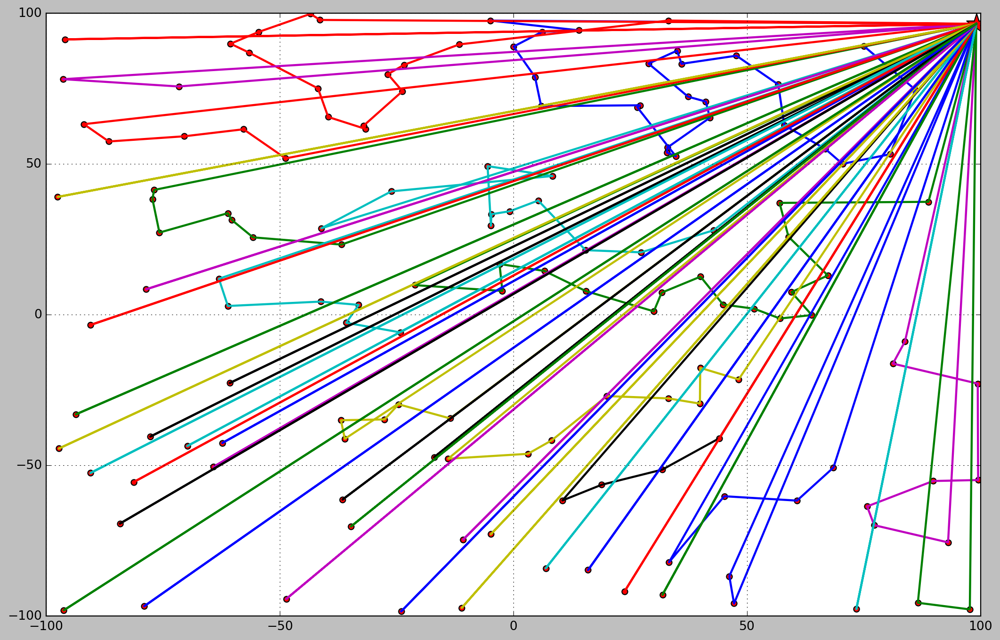


## Max cost 400 doesn't quite work here, as the distances are much larger


```python
%time result_paths = sequential_nn(500)
```

    van 1: 493.1613509811791
    van 2: 498.37402590912467
    van 3: 499.57415652250484
    van 4: 490.0564767221547
    van 5: 497.67366460125766
    van 6: 491.0474410501304
    van 7: 476.1857519522164
    van 8: 487.87440569372217
    van 9: 462.17325815341474
    van 10: 486.2976818275437
    van 11: 498.3091236408933
    van 12: 466.4397450832517
    van 13: 464.4374453992292
    van 14: 494.26350457825447
    van 15: 525.5364809069648
    van 16: 551.3280289580272
    CPU times: user 573 ms, sys: 20.1 ms, total: 593 ms
    Wall time: 588 ms


## Plot result paths


```python
for path in result_paths:
    coords=get_coords(path)
    plt.plot(coords[0], coords[1], linewidth=2)
plt.scatter(data.x, data.y, c='r', s=30)
plt.scatter(data.iloc[0].x, data.iloc[0].y, marker='*', c='r', s=400)
plt.axis([-100,100,-100,100])
plt.grid(True)
```


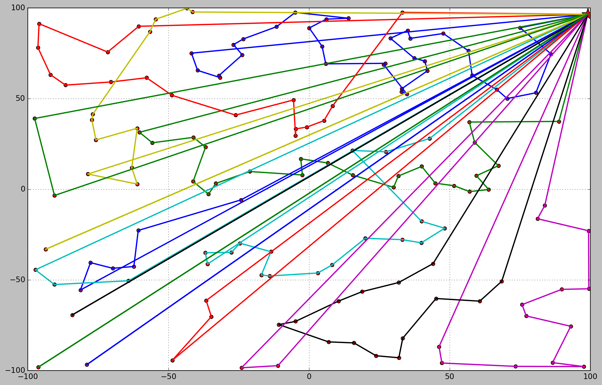


## Let's improve them with a 2-opt heuristic


```python
%time improve_result_paths()
```

    Starting path 1/16
    exchanging 84-134,77-0 with 84-77,134-0 => save=17.58671573136749 => cost: 475.57463524981165
    ...
    exchanging 131-9,85-73 with 131-85,9-73 => save=0.22871091978264957 => cost: 415.7579280346732
    Starting path 2/16
    exchanging 114-10,93-0 with 114-93,10-0 => save=4.063910634805211 => cost: 494.31011527431946
    exchanging 114-105,10-82 with 114-10,105-82 => save=2.900319415888454 => cost: 491.409795858431
    Starting path 3/16
    exchanging 4-13,123-0 with 4-123,13-0 => save=19.13464498164811 => cost: 480.43951154085676
    exchanging 65-14,52-33 with 65-52,14-33 => save=1.587339787656024 => cost: 478.8521717532007
    Starting path 4/16
    exchanging 19-16,55-0 with 19-55,16-0 => save=0.7537655368855951 => cost: 489.3027111852691
    ...
    exchanging 46-130,39-75 with 46-39,130-75 => save=1.7704562419552907 => cost: 455.4046302803684
    Starting path 5/16
    exchanging 37-112,94-0 with 37-94,112-0 => save=11.94699370814547 => cost: 485.7266708931122
    exchanging 58-110,28-107 with 58-28,110-107 => save=9.304516959883209 => cost: 476.422153933229
    Starting path 6/16
    exchanging 62-142,144-0 with 62-144,142-0 => save=23.25445433373693 => cost: 467.79298671639344
    Starting path 7/16
    Starting path 8/16
    exchanging 44-100,48-0 with 44-48,100-0 => save=1.0746379367560621 => cost: 486.7997677569661
    ...
    exchanging 44-98,8-48 with 44-8,98-48 => save=6.17952602155286 => cost: 476.7280985588525
    Starting path 9/16
    Starting path 10/16
    exchanging 113-5,72-0 with 113-72,5-0 => save=1.4836706701319144 => cost: 484.8140111574118
    Starting path 11/16
    Starting path 12/16
    Starting path 13/16
    Starting path 14/16
    Starting path 15/16
    Starting path 16/16
    CPU times: user 2.16 s, sys: 40 ms, total: 2.2 s
    Wall time: 2.24 s


## Plot improved paths


```python
for path in result_paths:
    coords=get_coords(path)
    plt.plot(coords[0], coords[1], linewidth=2)
plt.scatter(data.x, data.y, c='r', s=30)
plt.scatter(data.iloc[0].x, data.iloc[0].y, marker='*', c='r', s=400)
plt.axis([-100,100,-100,100])
plt.grid(True)
```


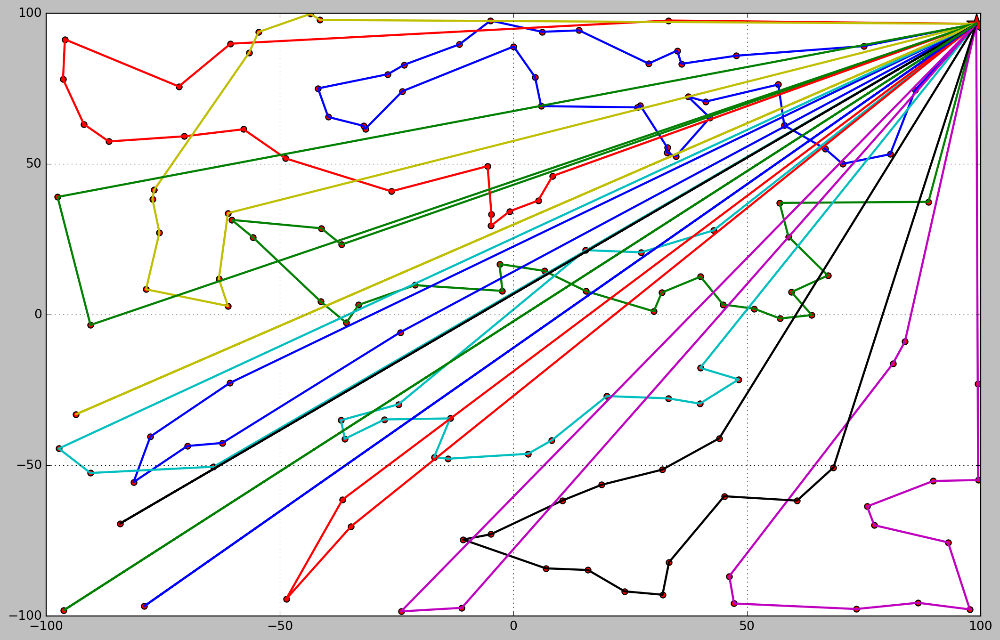


## Nice! Several clean paths, but some vans had to do only one distant delivery.

## As we see, it is better to increase the max cost again.

In a real system, there should be a way to estimate it based on a full day of work (generally 8 hours).
Let's try again.


```python
%time result_paths = sequential_nn(800)
```

    van 1: 792.9220639985251
    van 2: 793.9102149907774
    van 3: 749.3577273914822
    van 4: 769.1224381882283
    CPU times: user 1.03 s, sys: 18.5 ms, total: 1.05 s
    Wall time: 1.05 s


## Plot result paths


```python
for path in result_paths:
    coords=get_coords(path)
    plt.plot(coords[0], coords[1], linewidth=2)
plt.scatter(data.x, data.y, c='r', s=30)
plt.scatter(data.iloc[0].x, data.iloc[0].y, marker='*', c='r', s=400)
plt.axis([-100,100,-100,100])
plt.grid(True)
```


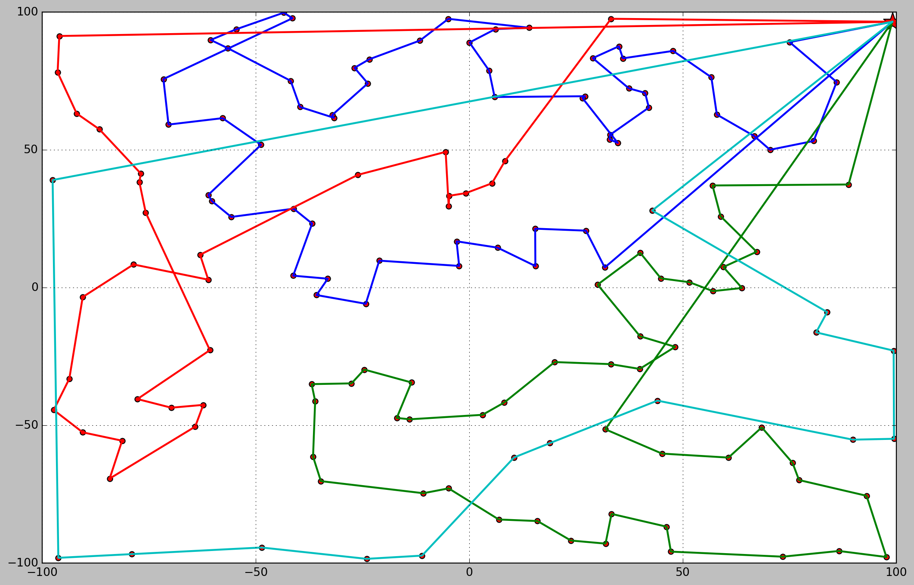


## Let's improve them with a 2-opt heuristic


```python
%time improve_result_paths()
```

    Starting path 1/4
    exchanging 84-51,77-0 with 84-77,51-0 => save=11.952005586800027 => cost: 780.9700584117251
    ...
    exchanging 66-51,147-126 with 66-147,51-126 => save=6.004072981449653 => cost: 732.2204189744828
    Starting path 2/4
    exchanging 35-69,29-0 with 35-29,69-0 => save=15.964056951390774 => cost: 777.9461580393865
    ...
    exchanging 35-129,90-42 with 35-90,129-42 => save=14.532045586175727 => cost: 750.7675349695343
    Starting path 3/4
    exchanging 4-124,123-0 with 4-123,124-0 => save=19.23021437016152 => cost: 730.1275130213206
    ...
    exchanging 65-14,52-33 with 65-52,14-33 => save=1.587339787656024 => cost: 701.2274950765787
    Starting path 4/4
    exchanging 19-21,54-0 with 19-54,21-0 => save=12.646642051225456 => cost: 756.4757961370028
    CPU times: user 3.71 s, sys: 44.8 ms, total: 3.75 s
    Wall time: 3.81 s


## Plot improved paths


```python
for path in result_paths:
    coords=get_coords(path)
    plt.plot(coords[0], coords[1], linewidth=2)
plt.scatter(data.x, data.y, c='r', s=30)
plt.scatter(data.iloc[0].x, data.iloc[0].y, marker='*', c='r', s=400)
plt.axis([-100,100,-100,100])
plt.grid(True)
```


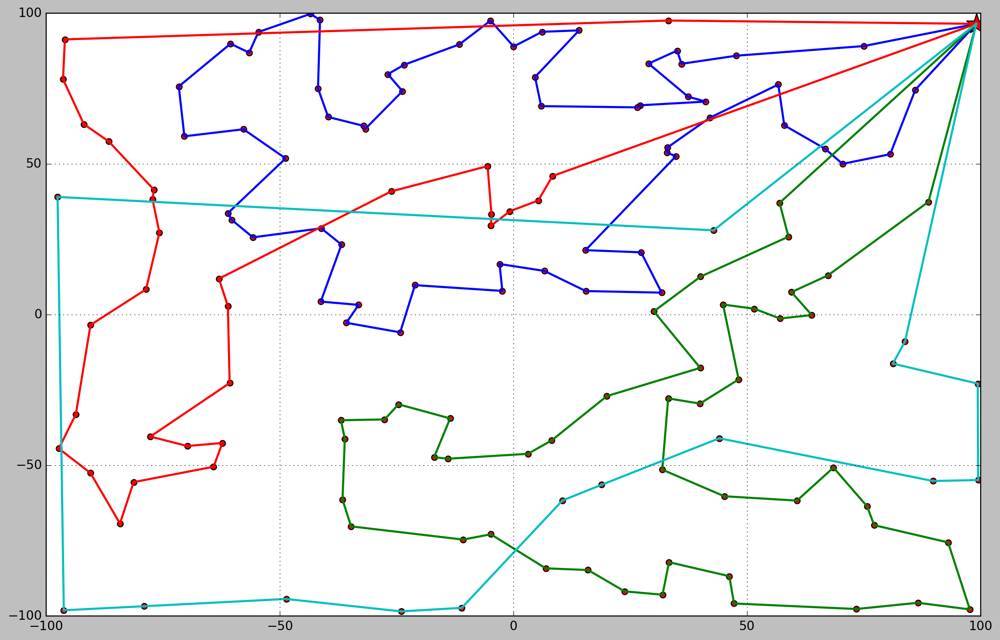


## Nice, clean paths. But with several overlaps.

In a real system, it should be analysed not only the cost (distance), but also the number of points in the route. Each one introduces a delay, as the driver has to park, walk, wait the customer, etc.

# Scenario: farthest depot, several vans, KMeans clustering

## Compute delivery clusters


```python
from sklearn.cluster import KMeans

work_per_van=20 #how many deliveries each van will start, ie granularity; a better approach would be capacity.
model = KMeans(n_clusters=1+size//work_per_van, init='k-means++', random_state=0)
%time model.fit(data[['x', 'y']])
```

    CPU times: user 91.4 ms, sys: 10.6 ms, total: 102 ms
    Wall time: 111 ms


    KMeans(algorithm='auto', copy_x=True, init='k-means++', max_iter=300,
        n_clusters=8, n_init=10, n_jobs=1, precompute_distances='auto',
        random_state=0, tol=0.0001, verbose=0)


## Plot clusters


```python
plt.scatter(data.x, data.y, marker='o', c=model.labels_, s=200)
plt.scatter(model.cluster_centers_[:,0], model.cluster_centers_[:,1], marker='+', c='r', s=500)
plt.scatter(data.iloc[0].x, data.iloc[0].y, marker='*', c='r', s=400)
plt.axis([-100,100,-100,100])
plt.grid(True)
```


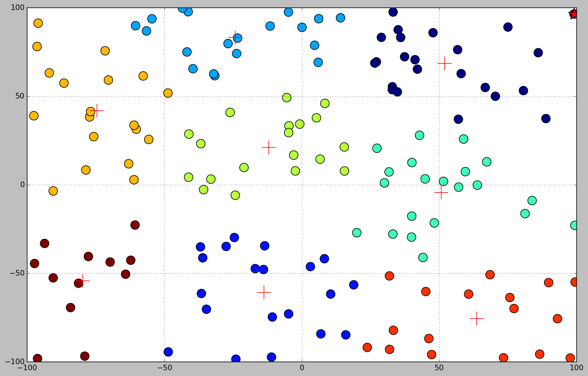


## Let's apply a greedy NN algorithm sequentially, on each of the clusters


```python
%time result_paths = greedy_nn_clusters()    
```

    van 1: 390.25298877225174
    van 2: 687.7516428319581
    van 3: 382.7248611037869
    van 4: 505.82568809746317
    van 5: 478.6115152097322
    van 6: 644.9250908928291
    van 7: 595.3986361541317
    van 8: 665.6387979350595
    CPU times: user 154 ms, sys: 16.6 ms, total: 170 ms
    Wall time: 165 ms


## Plot result paths


```python
plt.scatter(data.x, data.y, marker='o', c=model.labels_, s=200)
plt.scatter(model.cluster_centers_[:,0], model.cluster_centers_[:,1], marker='+', c='r', s=500)
for path in result_paths:
    coords=get_coords(path)
    plt.plot(coords[0], coords[1], 'k-', linewidth=2)
plt.scatter(data.iloc[0].x, data.iloc[0].y, marker='*', c='r', s=400)
plt.axis([-100,100,-100,100])
plt.grid(True)
```


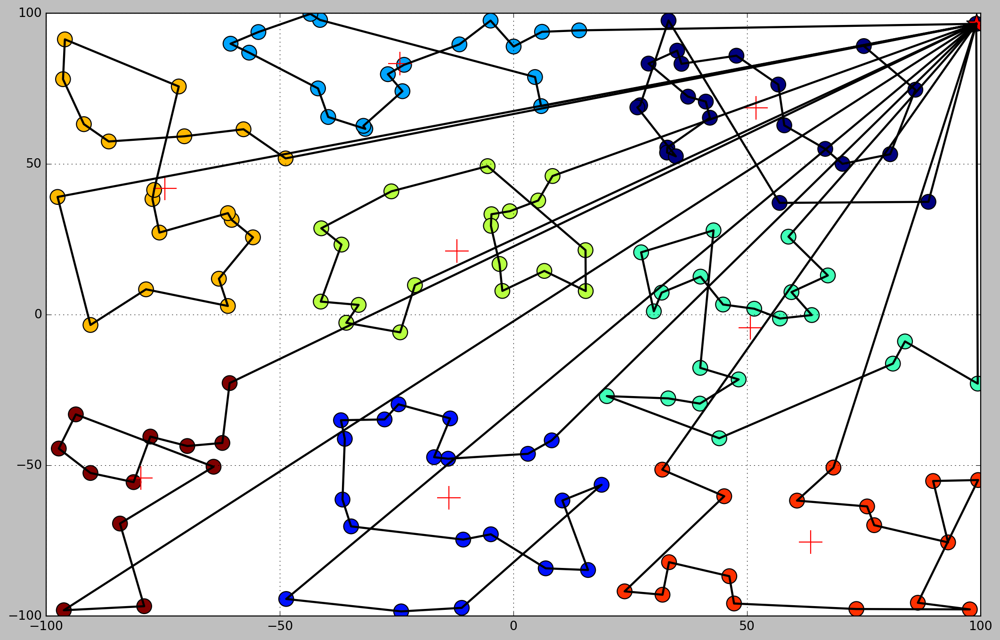


## Let's improve them with a 2-opt heuristic


```python
%time improve_result_paths()
```

    Starting path 1/8
    exchanging 77-4,83-29 with 77-83,4-29 => save=0.8194748732687884 => cost: 389.43351389898294
    ...
    exchanging 6-143,128-89 with 6-128,143-89 => save=5.407506824441722 => cost: 324.93008877322006
    Starting path 2/8
    exchanging 30-5,34-0 with 30-34,5-0 => save=4.481243727960788 => cost: 683.2703991039973
    ...
    exchanging 115-95,121-18 with 115-121,95-18 => save=8.322195150021315 => cost: 594.5702251203929
    Starting path 3/8
    exchanging 32-59,99-41 with 32-99,59-41 => save=4.114432829335271 => cost: 378.61042827445164
    exchanging 17-78,26-87 with 17-26,78-87 => save=0.17155006280330554 => cost: 378.43887821164833
    Starting path 4/8
    exchanging 42-19,129-106 with 42-129,19-106 => save=3.8728268587745447 => cost: 501.9528612386886
    ...
    exchanging 37-94,54-0 with 37-54,94-0 => save=1.3747236340181104 => cost: 495.2855372216575
    Starting path 5/8
    exchanging 0-147,123-65 with 0-123,147-65 => save=11.990854640529989 => cost: 466.6206605692022
    ...
    exchanging 135-65,123-0 with 135-123,65-0 => save=3.919229108305899 => cost: 435.93197839715947
    Starting path 6/8
    exchanging 56-21,15-0 with 56-15,21-0 => save=6.923848236857282 => cost: 638.0012426559717
    ...
    exchanging 102-43,118-40 with 102-118,43-40 => save=15.652843812142969 => cost: 602.6373464143627
    Starting path 7/8
    exchanging 63-24,107-110 with 63-107,24-110 => save=11.657922849361384 => cost: 583.7407133047703
    ...
    exchanging 112-36,91-125 with 112-91,36-125 => save=4.722248082275083 => cost: 559.3163570654888
    Starting path 8/8
    exchanging 48-111,98-137 with 48-98,111-137 => save=11.5162692633929 => cost: 654.1225286716666
    ...
    exchanging 8-132,137-98 with 8-137,132-98 => save=7.784370993699362 => cost: 615.4951078634247
    CPU times: user 2.17 s, sys: 49.8 ms, total: 2.22 s
    Wall time: 2.39 s


## Plot improved paths


```python
plt.scatter(data.x, data.y, marker='o', c=model.labels_, s=200)
plt.scatter(model.cluster_centers_[:,0], model.cluster_centers_[:,1], marker='+', c='r', s=500)
for path in result_paths:
    coords=get_coords(path)
    plt.plot(coords[0], coords[1], 'k-', linewidth=2)
plt.scatter(data.iloc[0].x, data.iloc[0].y, marker='*', c='r', s=400)
plt.axis([-100,100,-100,100])
plt.grid(True)
```


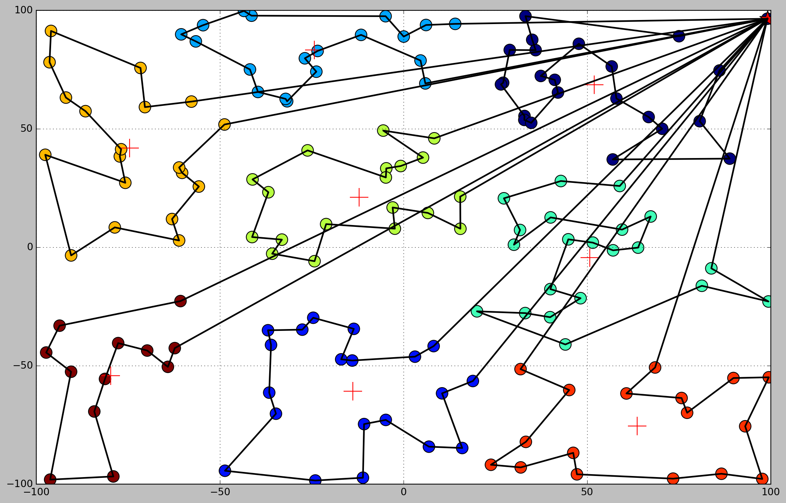


## Very cool subsections! Aproximately the same number of deliveries in each route!

But some routes are way longer than others. Some vans maybe will have to do an extra hour or two.

---

## That's it!
### Thank you for getting this far, hope you liked! :)
